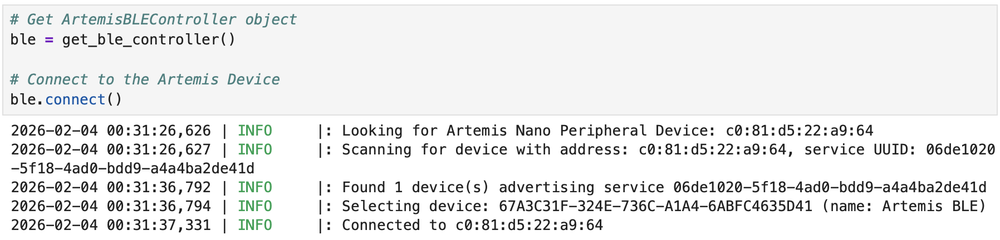
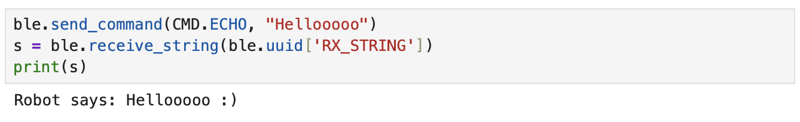
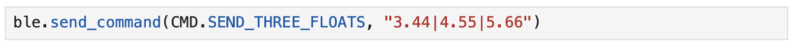
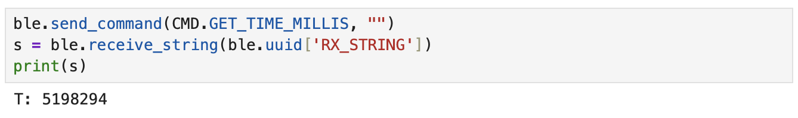
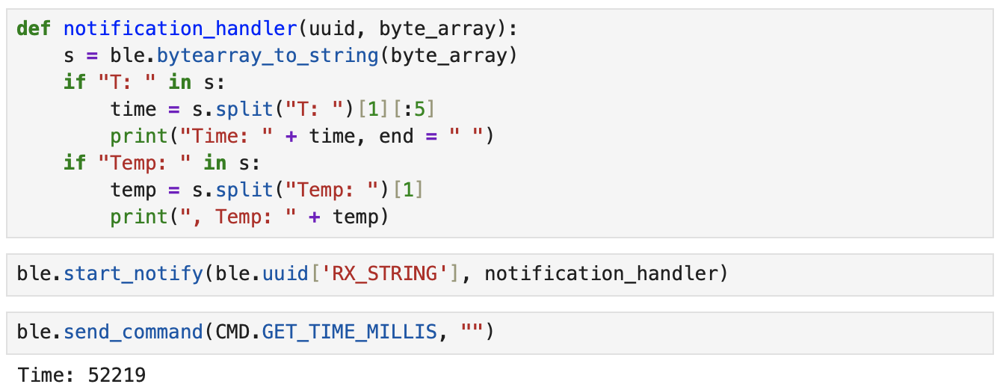
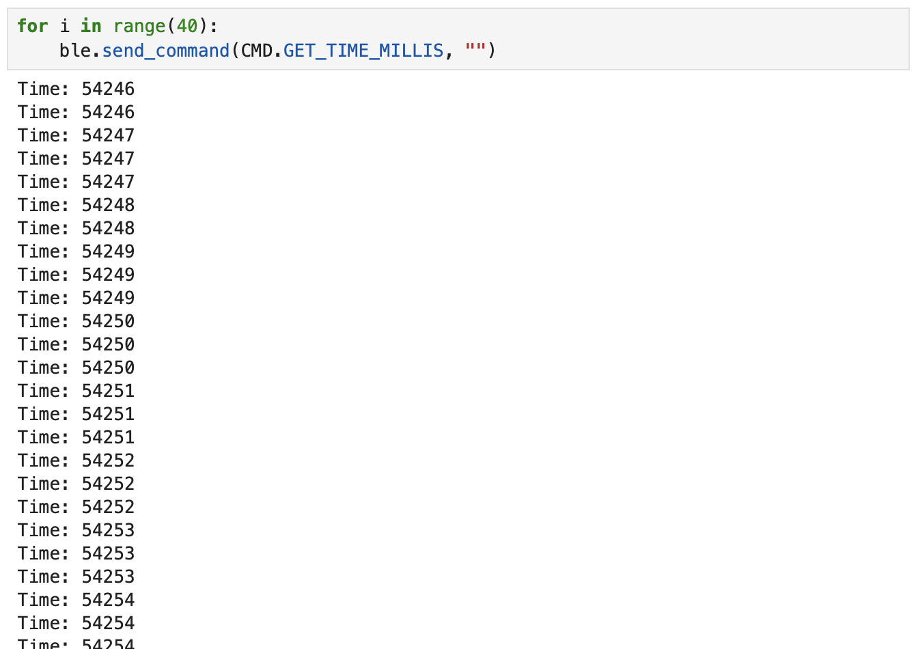
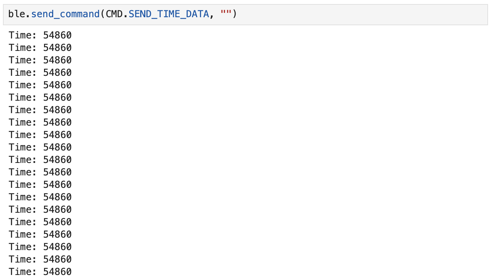
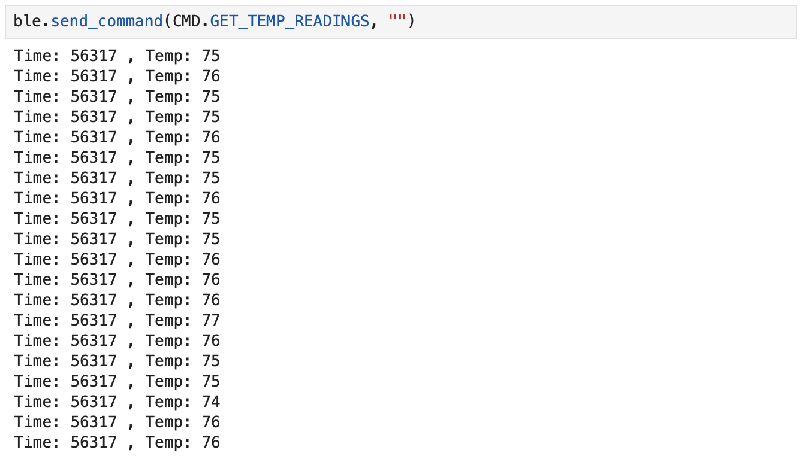

<link rel="stylesheet" href="../index.css" />

# Lab 1: Artemis and Bluetooth

## Lab 1A
In order to set up my computer for Lab 1, I installed the Arduino IDE and updated Python. Then, I installed necessary packages and activated the virtual environment. I then connected the Artemis Nano to my computer. I ensured that I was able to communicate with the board and that the components worked by running several example sketches.

### 1. Blink
The blue LED on the board flashes.
<video width="480" height="310" controls loop="" muted="" autoplay="">
    <source src="https://github.com/yating3/fast-robots/raw/refs/heads/main/Lab1/lab1_blink.mov" />
</video>

### 2. Serial
Message are echoed back in the Serial Monitor.


### 3. Analog Read
The temperature reading increases when I hold the board in my hand.
<video width="480" height="310" controls loop="" muted="" autoplay="">
    <source src="https://github.com/yating3/fast-robots/raw/refs/heads/main/Lab1/lab1_temp.mov" />
</video>

### 4. Microphone Output
Making noise raises the frequency of the microphone input.
<video width="480" height="310" controls loop="" muted="" autoplay="">
    <source src="https://github.com/yating3/fast-robots/raw/refs/heads/main/Lab1/lab1_freq.mov" />
</video>

## Lab 1B
This part of the lab focused on establishing a bluetooth connection between my computer and the Artemis board. This is done using Bluetooth Low Energy (BLE) which is analogous to a bulletin board with computers acting as community members reading the bulletin board. The Artemis board acts as the bulletin board which the computer reads from. This lab also uses a codebase that holds the functions that will be used. The file ble_arduino.ino contains the code that will run the Artemis board.

### Update Artemis MAC Address
I got the MAC address by burning the ble_arduino.ino sketch. I then updated the MAC address in connections.yaml.

Arduino IDE Serial monitor output:
```
Advertising BLE with MAC: c0:81:d5:22:a9:64
```
### Change BLEService UUID
I generated the UUID in jupyter. I then updated the UUID in ble_arduino.ino and connections.yaml.

Jupyter lab output:
```
UUID('54d98045-b89c-437c-b219-ad830cef9fff')
```

### Bluetooth Connection
After setting everything up, I was able to establish a bluetooth connection.



### Task 1
Send a string from the computer to the Artemis board using the ECHO command.

```
case ECHO:

    char char_arr[MAX_MSG_SIZE];

    // Extract the next value from the command string as a character array
    success = robot_cmd.get_next_value(char_arr);
    if (!success)
        return;

    tx_estring_value.clear();
    tx_estring_value.append("Robot says: ");
    tx_estring_value.append(char_arr);
    tx_estring_value.append(" :)");
    tx_characteristic_string.writeValue(tx_estring_value.c_str());
    
    break;
```
Jupyter lab output:



### Task 2
Send 3 floats to the Artemis board using the SEND_THREE_FLOATS command.

```
case SEND_THREE_FLOATS:
    float float_a, float_b, float_c;

    // Extract the next value from the command string as an integer
    success = robot_cmd.get_next_value(float_a);
    if (!success)
        return;

    // Extract the next value from the command string as an integer
    success = robot_cmd.get_next_value(float_b);
    if (!success)
        return;

    // Extract the next value from the command string as an integer
    success = robot_cmd.get_next_value(float_c);
    if (!success)
        return;

    Serial.print("Three Floats: ");
    Serial.print(float_a);
    Serial.print(", ");
    Serial.print(float_b);
    Serial.print(", ");
    Serial.println(float_c);

    break;
```
Sending command:



Serial monitor output:


### Task 3
Write a GET_TIME_MILLIS command that returns a string with the time in milliseconds.
```
case GET_TIME_MILLIS:

    tx_estring_value.clear();
    tx_estring_value.append("T: ");
    tx_estring_value.append((int) millis());
    tx_characteristic_string.writeValue(tx_estring_value.c_str());

    break;
```
Jupyter lab output:



### Task 4
Set up a notification handler in Python that receives strings from the Artemis board and extracts the time.

Notification handler code and output:



### Task 5
Use a loop to generate and send the current time in milliseconds to my laptop for it to be processed by the notification handler.

Jupyter lab output:



I found that it took 1353 milliseconds to send 40 messages. This means that there was about 35 milliseconds between messages. Messages were being sent at a rate of about 30 messages/second. The strings sent were 11 bytes, one for each character. The effective data transfer rate is 330 bytes/second.

### Task 6
Create a global array to store time stamps. Create SEND_TIME_DATA which loops through the array sends data to my laptop to be processed. 
```
case SEND_TIME_DATA:   
    for (int i=0; i<size; i++){
        timestamp_array[i] = (int) millis();
    }
    
    for (int i=0; i<size; i++){
        tx_estring_value.clear();
        tx_estring_value.append("T: ");
        tx_estring_value.append(timestamp_array[i]);
        tx_characteristic_string.writeValue(tx_estring_value.c_str());             
    }

    break;
```

Jupyter lab output:



### Task 7
Add an array to store temperature readings corresponding with time. Create GET_TEMP_READINGS which loops through both arrays and sends each temperature reading with a time stamp.
```
case GET_TEMP_READINGS:   
    for (int i=0; i<size; i++){
        timestamp_array[i] = (int) millis();
    }

    for (int i=0; i<size; i++){
        temperature_array[i] = (int) getTempDegF();
    }
    
    for (int i=0; i<size; i++){
        tx_estring_value.clear();
        tx_estring_value.append("T: ");
        tx_estring_value.append(timestamp_array[i]);
        tx_estring_value.append(" Temp: ");
        tx_estring_value.append(temperature_array[i]);
        tx_characteristic_string.writeValue(tx_estring_value.c_str());             
    }

    break;
```

Jupyter lab output:



### Task 8
The method of storing data in an array first allows you to collect more precise data as shown by the timestamps given. The timestamp doesn't change at all in the 30 element array. The values change more frequently for the method of sending the time every time it's received. The second method may require more power and storage for the volume of data collected, but it allows you to see changes in more detail. This could be helpful for recording something that happens very quickly. If something changes more slowly, the first method would be better. The second method records data at over 30 messages/millisecond. Since each message is 11 bytes, it can store about 35,000 data points.

## Discussion
I learned how to connect the Artemis board with my laptop using bluetooth. I also gained a better understanding of how bluetooth works and the different operations that I can use to send and receive data from the board. Overall it wasn't too challenging, but I did have to spend some time debugging and fixing errors. 
