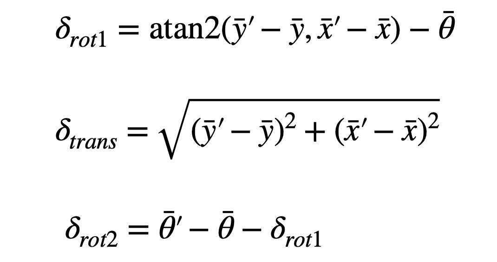

<link rel="stylesheet" href="../index.css" />

# Lab 10: Localization (sim)

The goal of this lab is to implement grid localization using Bayes filter. Bayes filter is a recursive algorithm that can find the probabilistic distribution for the position of a robot. It uses both sensor measurements and control data. The algorithm consists of a prediction step and an update step. 

## Function 1: compute_control

This function computes rotation 1, translation, and rotation 2 based on the odometry motion model. I based it on the following equations derived in lecture:



```
def compute_control(cur_pose, prev_pose):
    """ Given the current and previous odometry poses, this function extracts
    the control information based on the odometry motion model.

    Args:
        cur_pose  ([Pose]): Current Pose
        prev_pose ([Pose]): Previous Pose 

    Returns:
        [delta_rot_1]: Rotation 1  (degrees)
        [delta_trans]: Translation (meters)
        [delta_rot_2]: Rotation 2  (degrees)
    """
    cur_x, cur_y, cur_theta = cur_pose
    prev_x, prev_y, prev_theta = prev_pose

    delta_rot_1 = mapper.normalize_angle(math.degrees(np.arctan2(cur_y - prev_y, cur_x - prev_x)) - prev_theta)

    delta_trans = np.sqrt((cur_y - prev_y)**2 + (cur_x - prev_x)**2)
    
    delta_rot_2 = mapper.normalize_angle(cur_theta - prev_theta - delta_rot_1)
    
    return delta_rot_1, delta_trans, delta_rot_2
```

## Function 2: odom_motion_model

This function computes the transitional probability of the previous pose to the current pose given the control data.

```
def odom_motion_model(cur_pose, prev_pose, u):
    """ Odometry Motion Model

    Args:
        cur_pose  ([Pose]): Current Pose
        prev_pose ([Pose]): Previous Pose
        (rot1, trans, rot2) (float, float, float): A tuple with control data in the format 
                                                   format (rot1, trans, rot2) with units (degrees, meters, degrees)


    Returns:
        prob [float]: Probability p(x'|x, u)
    """

    delta_rot_1, delta_trans, delta_rot_2 = compute_control(cur_pose, prev_pose)
    
    prob_rot_1 = loc.gaussian(delta_rot_1, u[0], loc.odom_rot_sigma)
    prob_trans = loc.gaussian(delta_trans, u[1], loc.odom_trans_sigma)
    prob_rot_2 = loc.gaussian(delta_rot_2, u[2], loc.odom_rot_sigma)

    prob = prob_rot_1 * prob_trans * prob_rot_2
    
    return prob
```

## Function 3: prediction_step

This function updates the predicted belief based on the previous belief and the odometry motion model. I implemented this by iterating through all current and previous poses and computing the transition probabilities between them using the odom_motion_model function. Since the grid is 12x9x18, there are 1944 possible states. In order to reduce computation time, I skipped states that had a probability less than 0.0001. I had to normalize at the end to ensure that the probabilities sum to 1.

```
def prediction_step(cur_odom, prev_odom):
    """ Prediction step of the Bayes Filter.
    Update the probabilities in loc.bel_bar based on loc.bel from the previous time step and the odometry motion model.

    Args:
        cur_odom  ([Pose]): Current Pose
        prev_odom ([Pose]): Previous Pose
    """

    u = compute_control(cur_odom, prev_odom)

    # empty array same size as map
    loc.bel_bar = loc.bel_bar = np.zeros((mapper.MAX_CELLS_X, mapper.MAX_CELLS_Y, mapper.MAX_CELLS_A))

    for prev_x in range(mapper.MAX_CELLS_X):
        for prev_y in range(mapper.MAX_CELLS_Y):
            for prev_theta in range(mapper.MAX_CELLS_A):

                if (loc.bel[prev_x, prev_y, prev_theta] > 0.0001): #only continue if high prob

                    for cur_x in range(mapper.MAX_CELLS_X):
                        for cur_y in range(mapper.MAX_CELLS_Y):
                            for cur_theta in range(mapper.MAX_CELLS_A):
                                
                                prob = odom_motion_model(mapper.from_map(cur_x, cur_y, cur_theta),
                                                         mapper.from_map(prev_x, prev_y, prev_theta),
                                                         u)

                                loc.bel_bar[cur_x, cur_y, cur_theta] += prob * loc.bel[prev_x, prev_y, prev_theta]

    # normalize
    loc.bel_bar /= np.sum(loc.bel_bar)
```

## Function 4: sensor_model

This function returns the probability of each sensor measurement at a specific pose given the true observations.

```
def sensor_model(obs):
    """ This is the equivalent of p(z|x).


    Args:
        obs ([ndarray]): A 1D array consisting of the true observations for a specific robot pose in the map 

    Returns:
        [ndarray]: Returns a 1D array of size 18 (=loc.OBS_PER_CELL) with the likelihoods of each individual sensor measurement
    """

    return [loc.gaussian(obs[i], loc.obs_range_data[i], loc.sensor_sigma) for i in range(mapper.OBS_PER_CELL)]
```

## Function 5: update_step

This function updates beliefs given the sensor measurements. 

```
def update_step():
    """ Update step of the Bayes Filter.
    Update the probabilities in loc.bel based on loc.bel_bar and the sensor model.
    """

    for cur_x in range(mapper.MAX_CELLS_X):
        for cur_y in range(mapper.MAX_CELLS_Y):
            for cur_theta in range(mapper.MAX_CELLS_A):
                prob = sensor_model(mapper.get_views(cur_x, cur_y, cur_theta))
                loc.bel[cur_x, cur_y, cur_theta] = np.prod(prob) * loc.bel_bar[cur_x, cur_y, cur_theta]

    loc.bel /= np.sum(loc.bel)
```

## Simulation

After implementing the Bayes filter, I tested it using the simulation. The belief (in blue) closely follows the true position (in green). There is still some deviation from the ground truth due to noise. Despite this, it is much more accurate than the odometry model (in red). 

<video width="630" height="240" controls loop="" muted="" autoplay="">
    <source src="https://github.com/yating3/fast-robots/raw/refs/heads/main/Lab10/lab10_sim.mov" />
</video>

## Acknowledgements

I referenced Stephan Wagner's page for guidance on how to make my code more efficient. 
