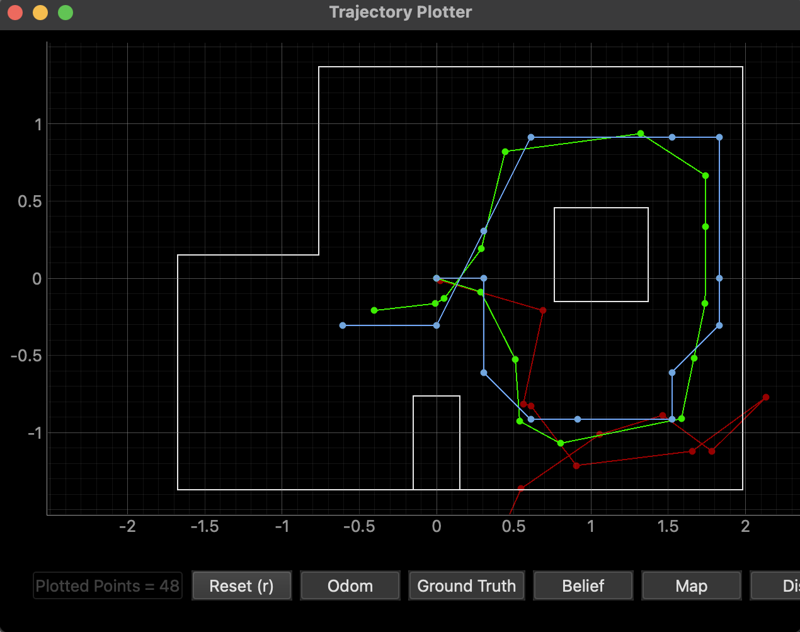
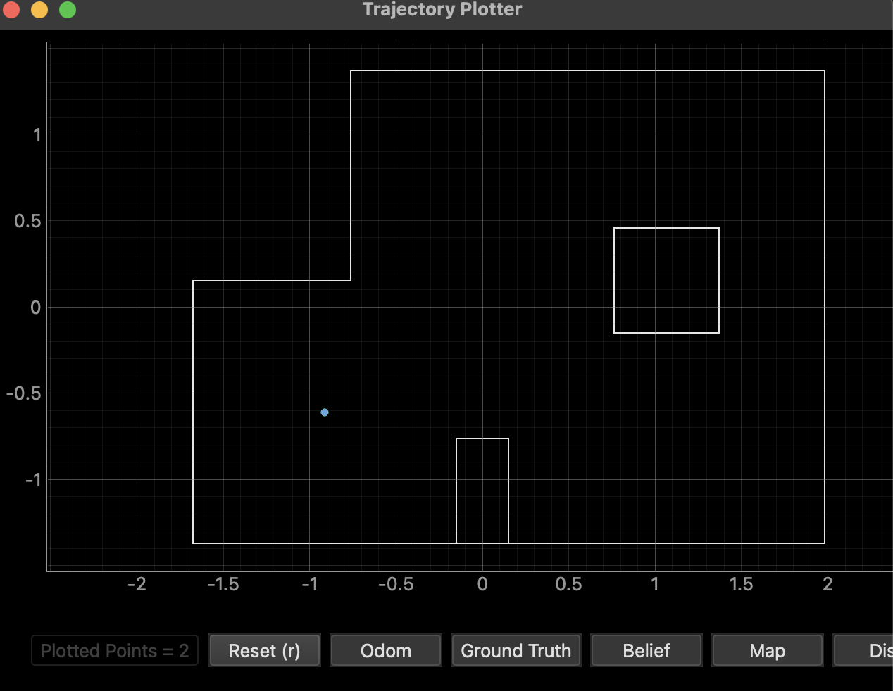
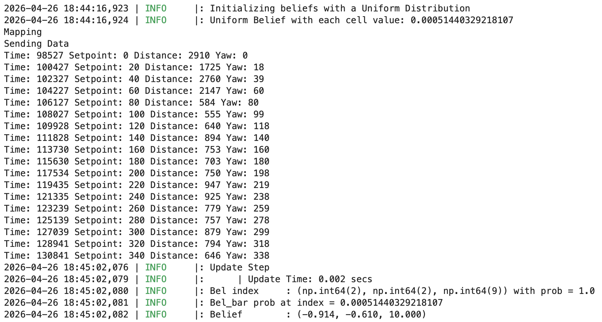
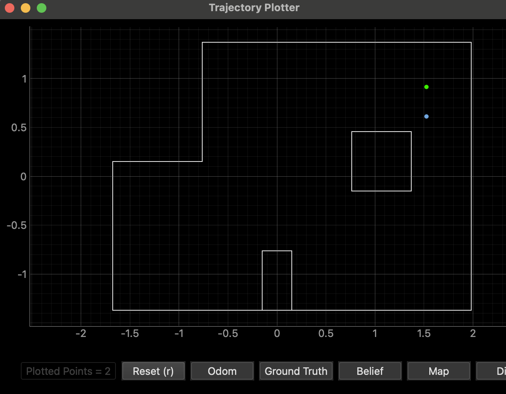
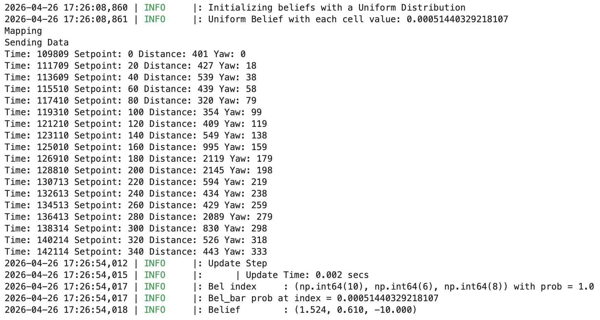
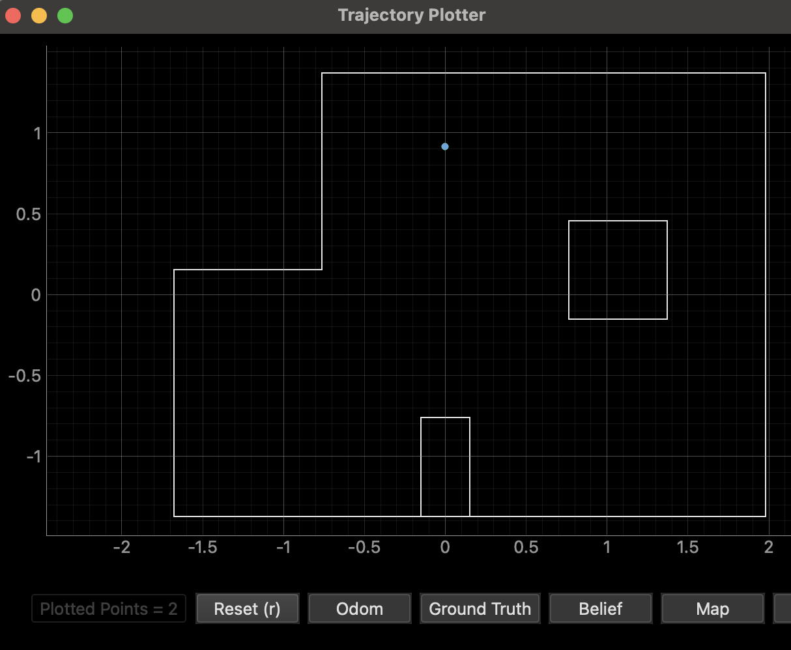
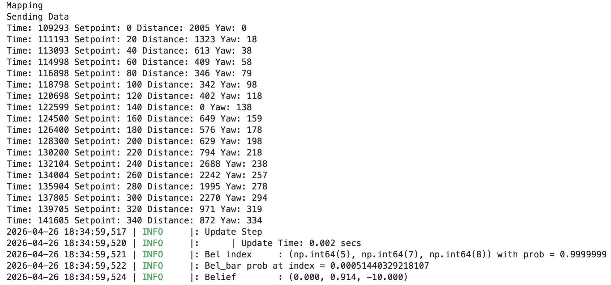
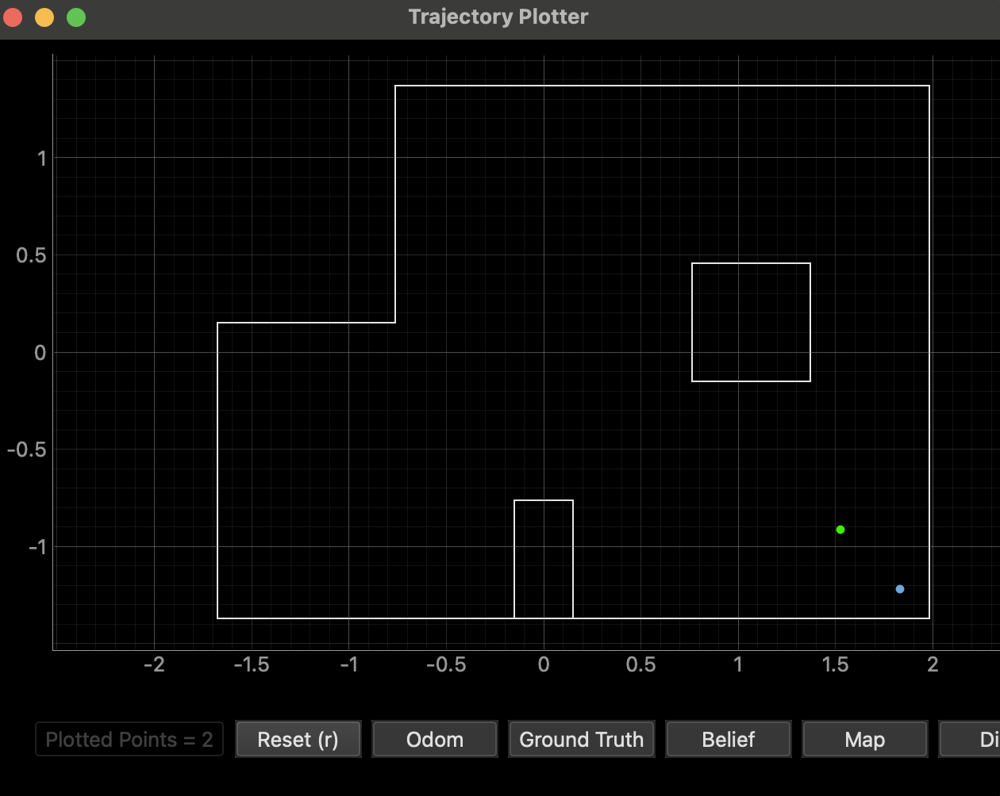
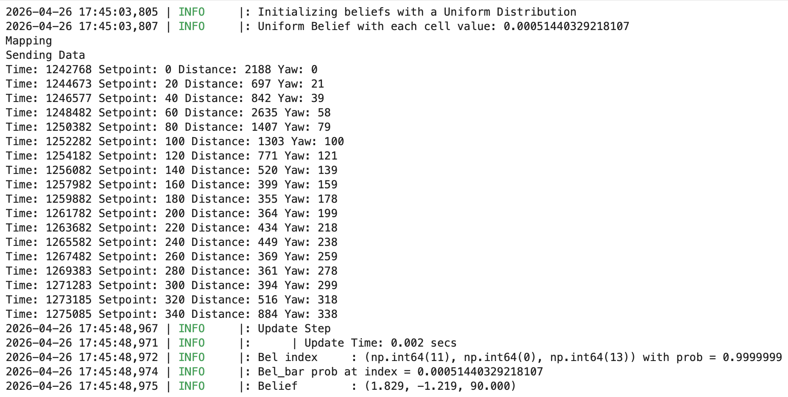

<link rel="stylesheet" href="../index.css" />

# Lab 11: Localization (real)

The goal of this lab is to perform localization with a Bayes filter on the real robot. To implement this, I collected distance data by doing a 360 degree scan at 4 different positions. 

## Simulation

I first tested the given localization implementation by running the simulation code. The behavior was expected. The belief (blue) was close to the ground truth (green). 

Plotted results:



## Implementation

The robot turns 360 degrees on axis in 20 degree increments. This yields 18 sensor readings. The code for turning and recording ToF data is very similar to lab 9 code. Since I was sending data over bluetooth, I had to use async and await. I needed to wait for the scanning to finish and for the data to be sent over. 

Code:

```
    async def perform_observation_loop(self, rot_vel=120):
        """Perform the observation loop behavior on the real robot, where the robot does  
        a 360 degree turn in place while collecting equidistant (in the angular space) sensor
        readings, with the first sensor reading taken at the robot's current heading. 
        The number of sensor readings depends on "observations_count"(=18) defined in world.yaml.
        
        Keyword arguments:
            rot_vel -- (Optional) Angular Velocity for loop (degrees/second)
                        Do not remove this parameter from the function definition, even if you don't use it.
        Returns:
            sensor_ranges   -- A column numpy array of the range values (meters)
            sensor_bearings -- A column numpy array of the bearings at which the sensor readings were taken (degrees)
                               The bearing values are not used in the Localization module, so you may return a empty numpy array
        """
        reset_arrays()
        print("Mapping")
        ble.send_command(CMD.SET_PWM_LIM, "122|220")
        ble.send_command(CMD.SET_CAL, "1.15")
        ble.send_command(CMD.START_MAPPING, "0.0025|1200|20")

        await asyncio.sleep(40)

        ble.send_command(CMD.STOP_MAPPING, "")
        print("Sending Data")
        ble.send_command(CMD.SEND_MAP_DATA, "")

        while (len(dist_arr) < 18):
            await asyncio.sleep(5)
        
        sensor_ranges = (np.array(dist_arr)/1000).reshape(-1,1)
        sensor_bearings = (np.array(yaw_arr)).reshape(-1,1)
        
        return sensor_ranges, sensor_bearings
```

## Results 

I tested my implementation by running the update step at 4 marked positions in the lab space. I then plotted the belief and ground truth. 

### (-3,-2)

The belief for this pose was almost exactly the same as the ground truth. This is likely due to it's unique surroundings. The walls almost form a complete box with one corner missing.





### (5,3)

The belief was about a foot off from the ground truth. This could be caused by its proximity to the box obstacle because the belief for (5,-3) was wrong as well. The ToF sensor measurements could also be having trouble with getting a good reading of the walls due to being in long range mode. 






### (0,3)

The belief for this pose was almost exactly the same as the ground truth. This is likely due to the fact that there is a distinct corner and pretty open space everywhere else. 






### (5,-3)

The belief was about a foot off from the ground truth. It seems to think that it's closer to the corner than it actually is. The distance sensor readings might be shorter than reality. If this is the case, the sensor may have been tilted. It could also be inaccurate for the same reasons as the point at (5,3).





The robot localized at some positions better than others. There are a variety of factors that contributed to this. I also noticed that it tended to have more errors in determining orientation than position. This could be attributed to the car not starting exactly at 0 degrees since I manually positioned it and my error tolerance of 2 for orientation PID. Overall, the real robot performance was fairly accurate.
