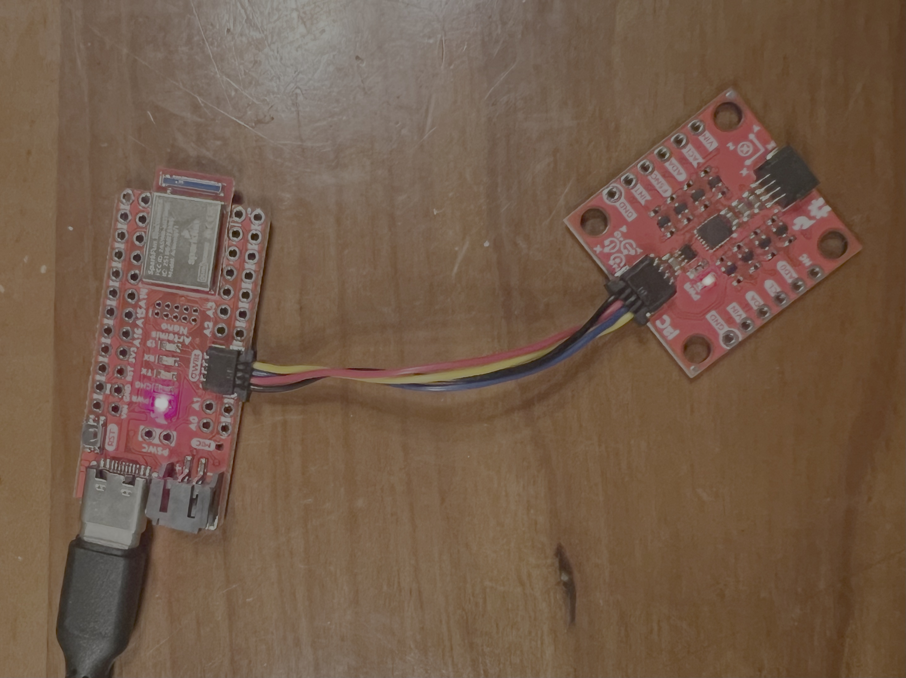
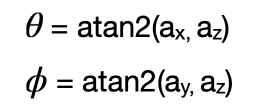
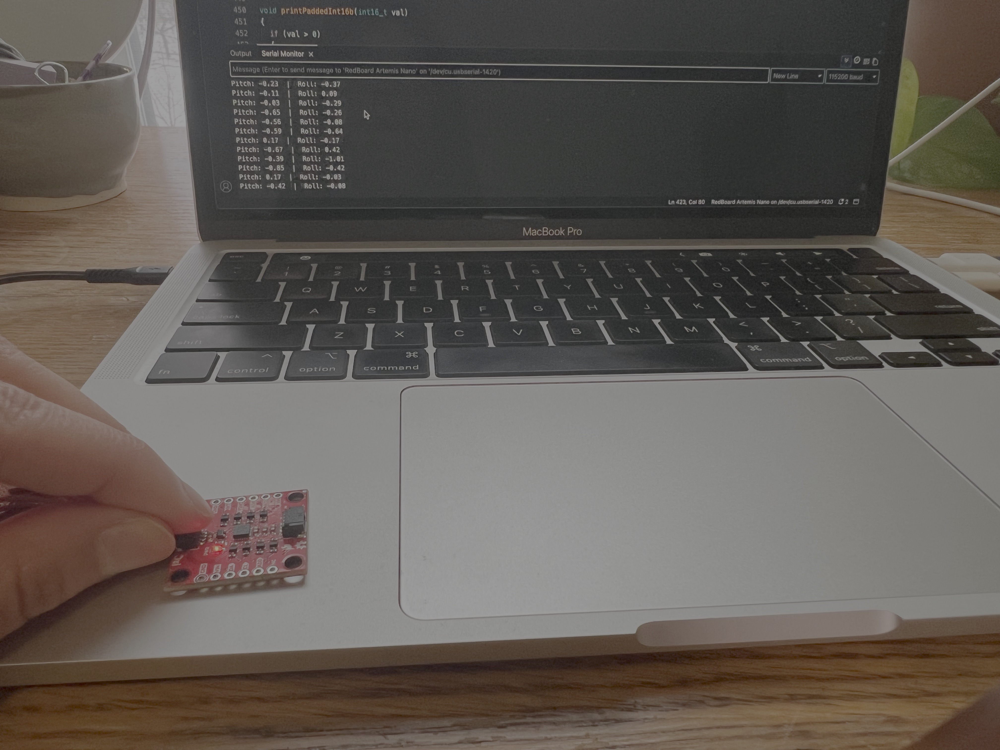
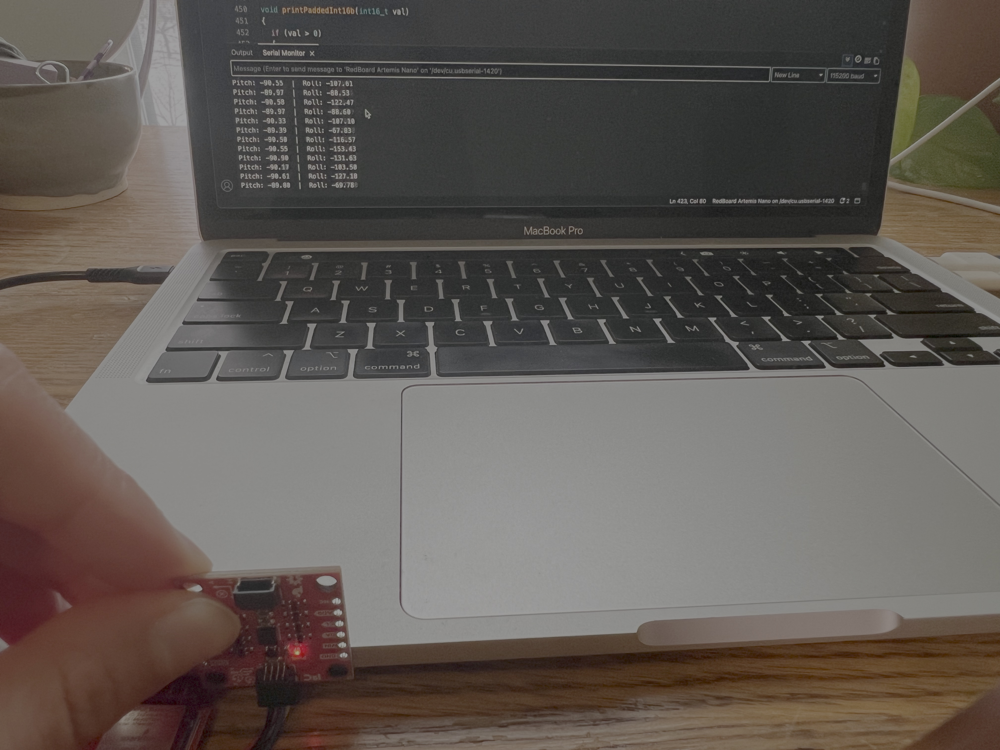
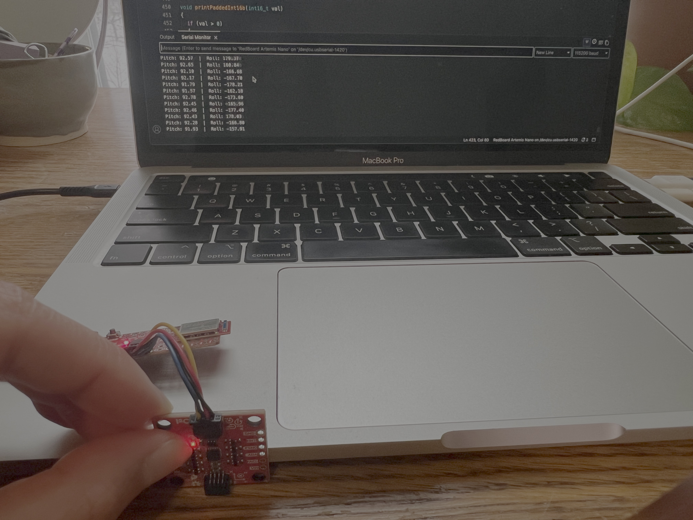
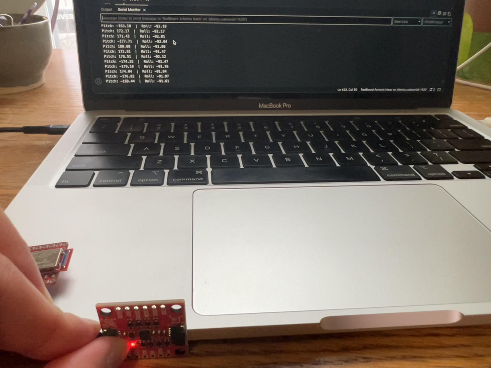
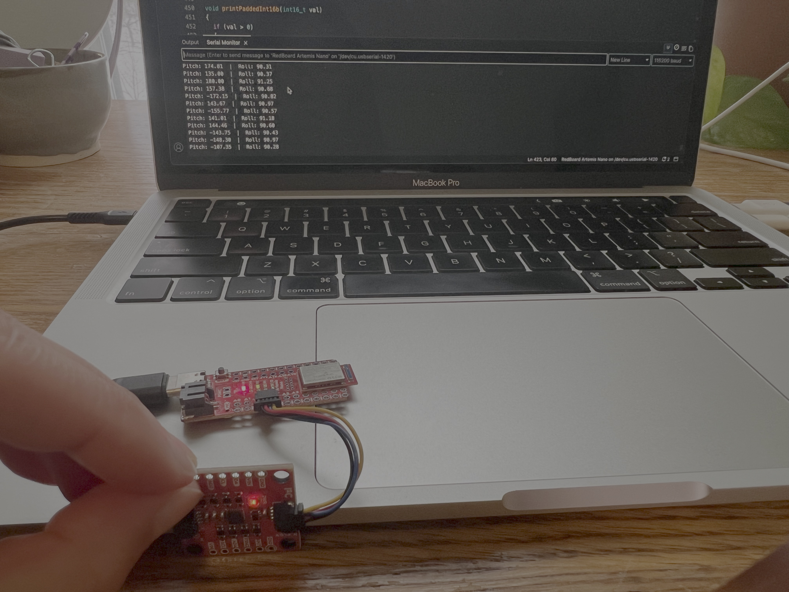
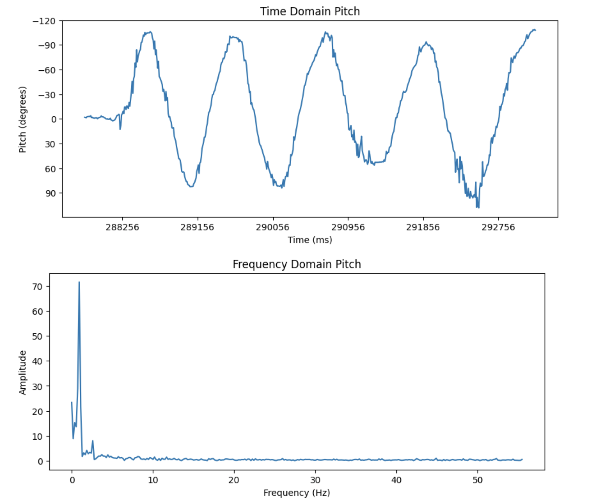
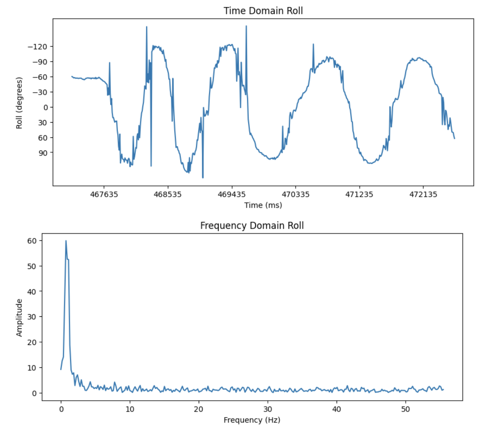
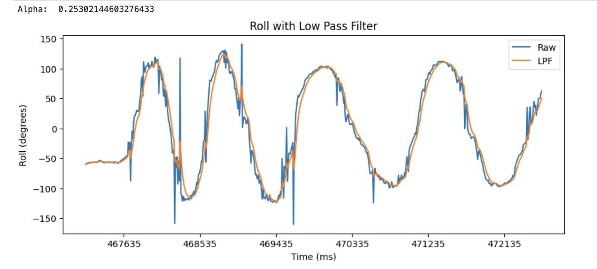

<link rel="stylesheet" href="../index.css" />

# Lab 2: IMU
In this lab I configured the intertial measurement unit 

## Set up the IMU

To set up the IMU, I installed the SparkFun IMU Arduino Library and connected the IMU to the Artemis board using QWIIC connectors. 



### Example Code
I tested the IMU using an Arduino example sketch. AD0_VAL is the last bit of the I2C address. It represents whether the ADR jumper is closed. It's 0 when the jumper is closed and 1 when it isn't. It should be 1 for this lab because the jumper isn't soldered close.

Running the Example1_Basics sketch:
<video width="480" height="310" controls loop="" muted="" autoplay="">
    <source src="https://github.com/yating3/fast-robots/raw/refs/heads/main/Lab2/lab2_example.mov" />
</video>

The Serial Monitor shows acceleration, gyroscope, and temperature data. The orientation of the axes is indicaated on the IMU. As I accelerate the sensor in the positive x, y, and z direction relative to gravity, the respective acceleration value increases. As I accelerate in the negative direction, it decreases. As I rotate the sensor in the positive x, y, and z direction, the respective gyroscope value increases. As I rotate in the negative direction, it decreases.
  
### Blink LED on Start-up
I added a loop that blinks the LED three times slowly on start-up as a visual indication that the board is running.
```
for (int i=0; i<3; i++){
    digitalWrite(LED_BUILTIN, HIGH);  // turn the LED on (HIGH is the voltage level)
    delay(1000);                      // wait for a second
    digitalWrite(LED_BUILTIN, LOW);   // turn the LED off by making the voltage LOW
    delay(1000);                      // wait for a second
}
```

## Accelerometer

### Calculating Pitch and Roll
I used the following equation from the lecture slides to calculate pitch and roll. I multiplied the value by 180/pi to convert from radians to degrees.



Arduino code:
```
acc_pitch = atan2(myICM.accX(), myICM.accZ()) * 180 / M_PI;
acc_roll = atan2(myICM.accY(), myICM.accZ()) * 180 / M_PI;
```

I created a function to print the pitch and roll to the serial monitor as well.
```
void printPitchRoll(float pitch, float roll) {
  SERIAL_PORT.print("Pitch: ");
  SERIAL_PORT.print(pitch);
  SERIAL_PORT.print("  |  ");

  SERIAL_PORT.print("Roll: ");
  SERIAL_PORT.print(roll);
  SERIAL_PORT.println();
}
```

0 degree pitch and roll:



-90 degree pitch:



90 degree pitch:



-90 degree roll:



90 degree roll:




The readings were a few degrees off, but this is likely due to the fact that it wasn't placed at exactly 0/90/-90 degrees. I believe that the acceleration data that I'm receiving is very accurate. It's never more than 3 degrees off and part of the error can be attributed to the uneven surface that I'm using to take measurements. I don't think a two-point calibration is necessary.

### Frequency Spectrum

  Noise in the frequency spectrum analysis
    Include graphs for your fourier transform
    Discuss the results
    
To get the signals for frequency spectrum analysis, I tilted the IMU back and forth. I used a 

Data for Pitch:




Data for Roll:



From these graphs, I believe that there is some noise that can be reduced with a low pass filter. This is because the spikes in the frequency graphs appear to be contained within 0 to 6 Hz. The cutoff frequency that I chose was 6 Hz. I chose this value because it would filter out the noise without distorting or losing the data that I want. From this, I calculated an alpha value of 0.25. After applying the low pass filter, I was able to obtain a less noisy signal.

Low Pass Filter on Pitch:


Low Pass Filter on Roll:



## Gyroscope
  Include documentation for pitch, roll, and yaw with images of the results of different IMU positions
  Demonstrate the accuracy and range of the complementary filter, and discuss any design choices

## Sample Data
  Speed of sampling discussion
  Demonstrate collected and stored time-stamped IMU data in arrays
  Demonstrate 5s of IMU data sent over Bluetooth

## Stunt

<video width="480" height="310" controls loop="" muted="" autoplay="">
    <source src="https://github.com/yating3/fast-robots/raw/refs/heads/main/Lab2/lab2_stunt.mov" />
</video>

The car was pretty responsive to the remote and took a few seconds to get to full speed. The forward/backward and left/right controls can be used together to do different turns. It can also spin in place without much displacement. To flip it, I drove it forward very quickly and changed direction. 
