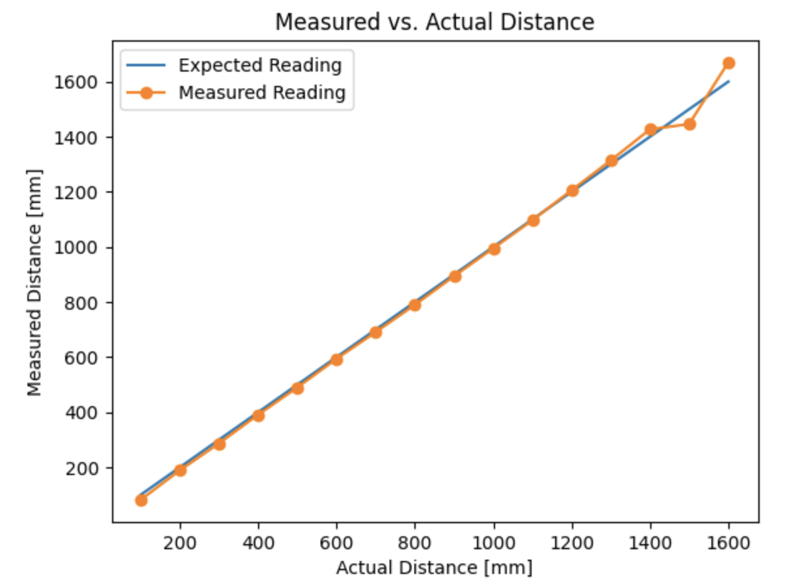
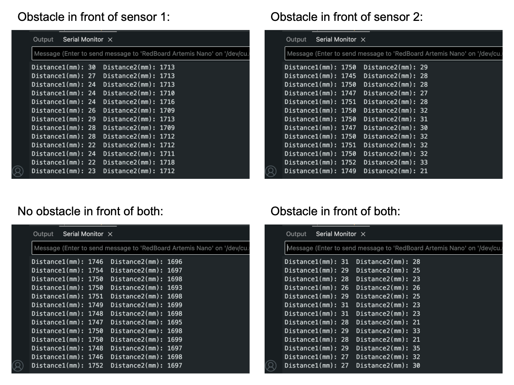
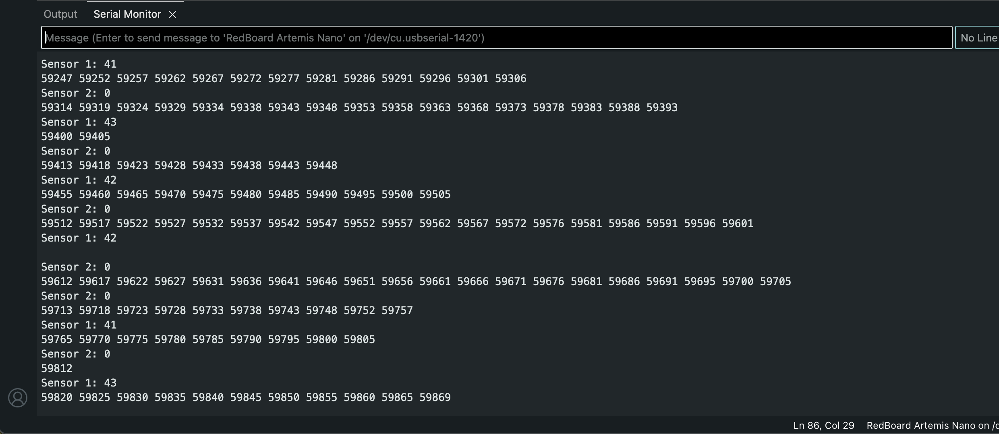
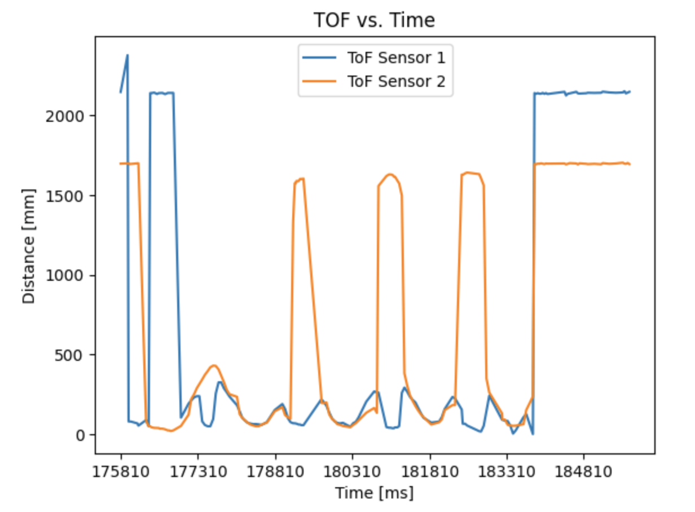
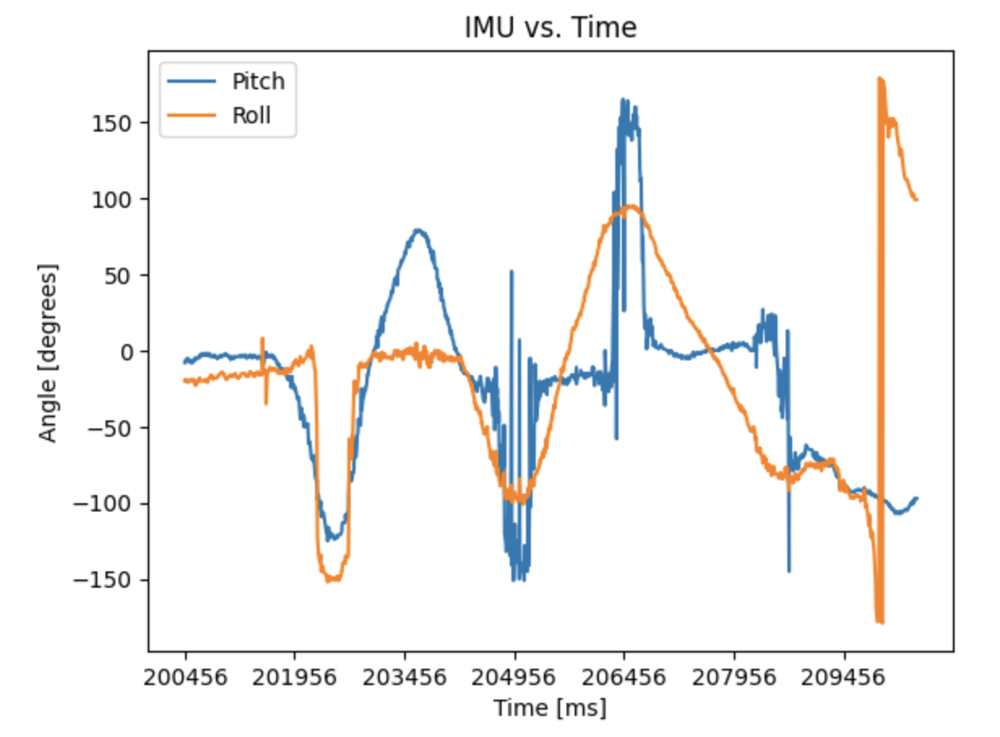

<link rel="stylesheet" href="../index.css" />

# Lab 3: ToF

The purpose of this lab is to attach and test time of flight sensors. The robot uses 2 VL53L1X ToF sensors to detect distance.

## Set Up

### Design

Before lab, I planned out the arrangement of components on my car and created a wiring diagram since I'll be permanently cutting and soldering wires. I chose to use the longer wires for the ToF sensors so that I would have more flexibility with the placement. I used the shorter wires for the Artemis and IMU since placement is less important. I decided to place one sensor on the front and one sensor on the right side. I will miss obstacles on the left and behind the robot. This will make it more challenging for the robot to move backwards and avoid obstacles when turning left. The front sensor will be used the most because the robot is usually moving forward. 

### Wiring
I used black for ground, red for power, blue for SDA, and yellow for SCL because this is standard. I used a white wire to connect xShut of one ToF sensor to pin 8 of the Artemis which enabled me to shut the sensor off and set the address of the other one. I connected the 2 ToF sensors and the IMU to the Artemis using the QWIIC breakout board. I cut one end of the QWIIC connect cables in order to solder them to the ToF sensors. In order to power the Artemis, I soldered a JST connector to the 750 mAh LIPO battery so it could be plugged into the board. I put heat shrink over the exposed wires to avoid shorting the battery. Using the battery, I was able to successfully send BLE messages between my laptop and the Artemis.


### I2C Channel

Example05_wire_I2C scans the I2C channel to find the sensor. The address doesn't match what I initially expected. According to the ToF datasheet, it uses a device address of 0x52, but the serial monitor displayed 0x29 when I ran Example05_wire_I2C. 0x52 is 01010010 in binary. 0x29 is 00101001 in binary. 0x29 is 0x52 shifted right by one. The last binary digit of 0x52 is the read/write bit. It's 0 in this case indicating that the Artemis is writing to the sensor.

Serial monitor output:


## Lab Tasks

### Sensor Modes

Each sensing mode has a different maximum distance that they can detect obstacles. A longer distance means that the robot can see further and plan ahead. This is useful for large spaces where obstacles may be far away. Long mode has the longest distance at 4m. Medium is close behind at 3m. Short mode has a significantly shorter maximum distance of 1.3m that is 130% shorter than medium and 200% shorter than long. An advantage of short mode is that is has much better ambient light immunity. This means that it can work reliably under different lighting conditions. Bright lights negatively affect medium/long mode more than short mode which is barely effected. Another consideration is the timing budget. Short mode has the shortest minimum of 20ms, while long mode has the longest minimum of 140ms. This means that short mode can have a faster sampling rate, making it more precise. 

I chose to use short mode because it's the best fit for my robot. This is a fast moving robot so accuracy and precision are priorities. Additionally, I want it to be able to perform well regardless of lighting. I don't think the shorter detection distance will be an issue since it will be moving around a relatively small area.

Short mode distance readings using Example1_ReadDistance:


### Sensor Range, Accuracy, Repeatability, and Ranging Time

To measure range and accuracy, I took sensor readings in 10cm increments from 0 to 160cm. I found that the sensor range was 30 to 130cm. The difference between actual and measured distance was no more than 5% in this range. 

Testing setup:


Measured vs. Actual Distance Graph:



To measure repeatibility I recorded 200 data points for 30cm, 70cm, and 120cm. The sensor produces consistent results with little deviation at all these distances. It performed the best at 30cm which makes sense because it's using short range mode.

| Actual Distance (cm) | Median (Measured) | Range (Measured) | Standard Deviation (Measured) |
| --- | --- | --- | --- |
| 30 | 29.3325 | 0.5 | 0.09368139759 |
| 70 | 71.234 | 0.9 | 0.2031788887 |
| 120 | 120.3855 | 1.3 | 0.2260192835 |

To measure ranging time, I recorded the time in milliseconds between when the measurement is taken and just after the data is ready. Through this I found a ranging time of 29ms.

### Using 2 Sensors

After testing one ToF, I added the second ToF and IMU. I had to change the address of one ToF sensor because both sensors have the same default address. If they both have the same I2C address, they will respond at the same time causing a data collision.

All sensors connected:


Code for shutting down sensor 1 and changing sensor 2 address:

```
  pinMode(SHUTDOWN_PIN, OUTPUT);
  digitalWrite(SHUTDOWN_PIN, LOW); // shut down sensor 1
  distanceSensor.setI2CAddress(0x54); // change sensor 2 address
```

I was able to collect data from both sensors simultaneously. The readings of each sensor were completely independent of the other. 



### Measurement Speed

I wrote code that continuously prints the time (seperated by spaces) and checks if data is avaialable. It prints the sensor data when it's ready.

Loop for collecting and printing data:

```
void loop(void)
{
  Serial.print(millis());
  Serial.print(" ");
  distanceSensor.startRanging(); //Write configuration bytes to initiate measurement
  distanceSensor2.startRanging();

  if (distanceSensor.checkForDataReady()) {
    distance = distanceSensor.getDistance();
    Serial.println();
    Serial.print("Sensor 1: ");
    Serial.print(distance);
    Serial.println();
    distanceSensor.clearInterrupt();
    distanceSensor.stopRanging();
  }

  if (distanceSensor2.checkForDataReady()) {
    distance2 = distanceSensor2.getDistance();
    Serial.println();
    Serial.print("Sensor 2: ");
    Serial.print(distance2);
    Serial.println();
    distanceSensor2.clearInterrupt();
    distanceSensor2.stopRanging();
  }
}
```

Results:



When sensor data isn't available, the loop executes in 5ms. When there is sensor 1 data available, the loop executes in 7ms. When there is sensor 2 data available, the loop executes in 8ms. When there is both data available, the loop executes in 11ms. The current limiting factor is the rate that the ToF sensor can collect data. It's slower than the Artemis clock.

### Data Over Bluetooth

I wrote 2 new commands in ble_arduino.ino: BLE_TOF and BLE_IMU for recording and sending 10000ms of BLE and IMU data. I then received the data using a notification handler in jupyter. I decided to use a notification handler because it automatically collects, prints, and stores the data in arrays. 

Plot of ToF data vs. time:



Plot of IMU data vs. time:



