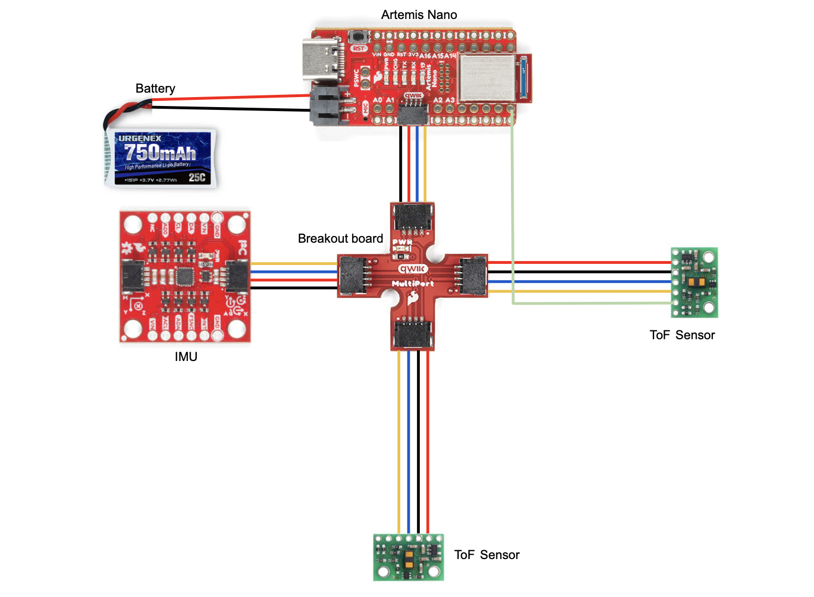
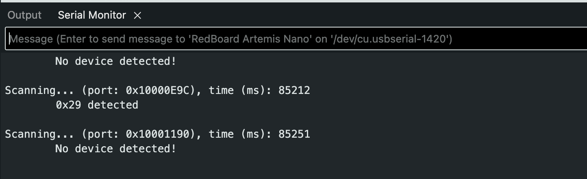
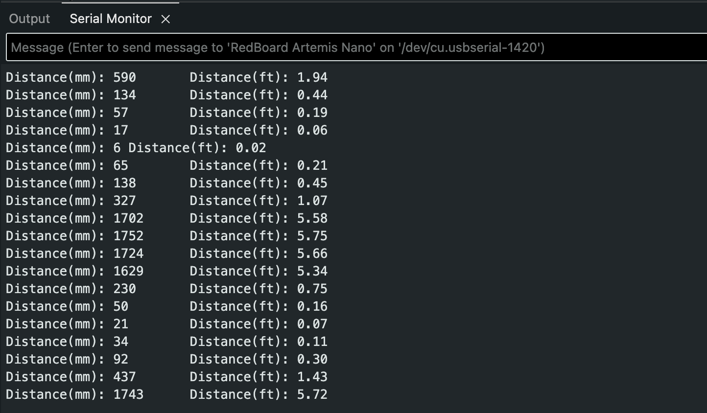
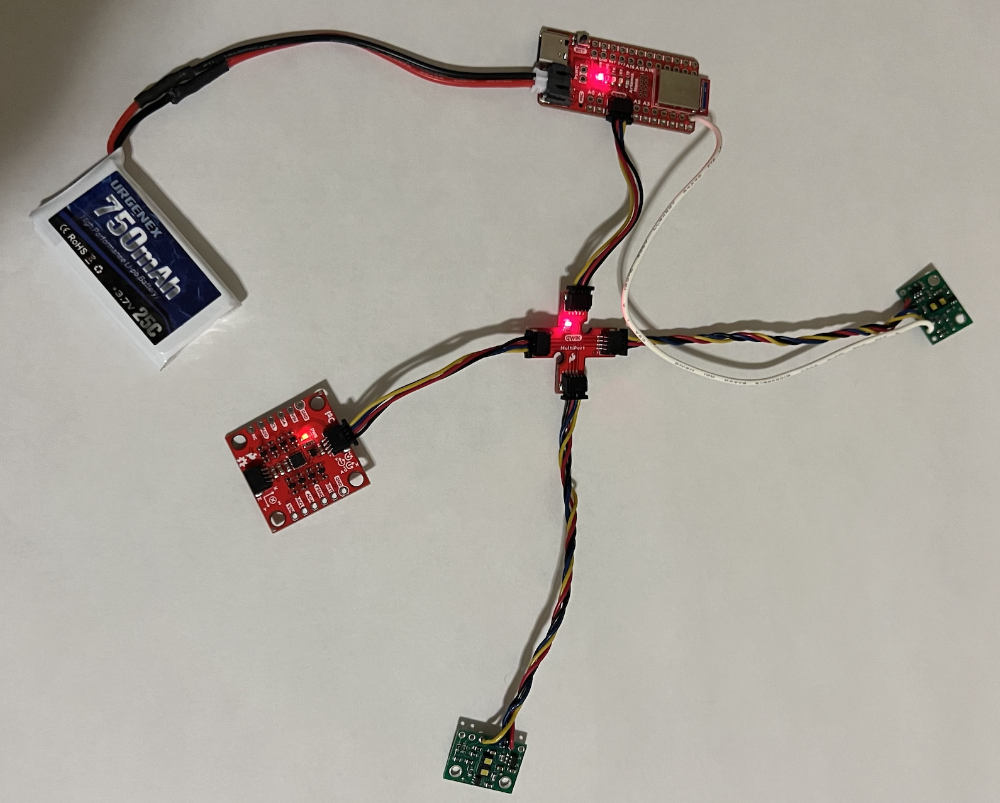

<link rel="stylesheet" href="../index.css" />

# Lab 3: ToF

The purpose of this lab is to attach and test time of flight sensors. The robot uses 2 VL53L1X ToF sensors to detect distance.

## Set Up

### Design

Before lab, I planned out the arrangement of components on my car and created a wiring diagram since I'll be permanently cutting and soldering wires. I chose to use the longer wires for the ToF sensors so that I would have more flexibility with the placement. I used the shorter wires for the Artemis and IMU since placement is less important. I decided to place one sensor on the front and one sensor on the right side. I will miss obstacles on the left and behind the robot. This will make it more challenging for the robot to move backwards and avoid obstacles when turning left. The front sensor will be used the most because the robot is usually moving forward. 

### Wiring
I used black for ground, red for power, blue for SDA, and yellow for SCL because this is standard. I used a white wire to connect xShut of one ToF sensor to pin 8 of the Artemis which enabled me to shut the sensor off and set the address of the other one. This allows me to use both simultaneously. I connected the 2 ToF sensors and the IMU to the Artemis using the QWIIC breakout board. I cut one end of the QWIIC connect cables in order to solder them to the ToF sensors. In order to power the Artemis, I soldered a JST connector to the 750 mAh LIPO battery so it could be plugged into the board. I then put heat shrink over the exposed wires to isolate them and avoid shorting the battery. 

### I2C Channel

Example05_wire_I2C scans the I2C channel to find the sensor. The address doesn't match what I initially expected. According to the ToF datasheet, it uses a device address of 0x52, but the serial monitor displayed 0x29 when I ran Example05_wire_I2C. 0x52 is 01010010 in binary. 0x29 is 00101001 in binary. 0x29 is 0x52 shifted right by one. The last binary digit of 0x52 is the read/write bit. It's 0 in this case indicating that the Artemis is writing to the sensor.

Serial monitor output:

## Lab Tasks

### Sensor Modes

Short mode: An advantage of it is that is has better ambient immunity than other modes. This means that it . A tradeoff of short mode is that it has a maximum distance of that is % shorter than medium and % shorter than long. 

Medium mode: A benefit of medium mode is the maximum distance of 3m. 

Long mode: A benefit of medium mode is the maximum distance of 3m. 

Short mode distance readings:

7. Test your chosen mode
- Use the “..\Arduino\libraries\SparkFun_VL53L1X_4m_Laser_Distance_Sensor\examples\Example1_ReadDistance” example
- Document your ToF sensor range, accuracy, repeatability, and ranging time
- The figure below is an example from 2020, when students measured the accuracy and repeatability in different lighting conditions, and timing for various code setups (these are not all required tasks for this year), however, we highly recommend generating your plots in the Jupyter notebook to gain more familiarity with the environment, e.g. using matplotlib.

8. Using notes from the pre-lab, hook up both ToF sensors simultaneously and demonstrate that both work.
- Don’t use the Example05_wire code to do this, it works poorly when multiple sensors are attached.

(2 ToF sensors and the IMU: Discussion and screenshot/video of sensors working in parallel)

9. In future labs, it is essential that the code executes quickly, therefore you cannot let your code hang while it waits for the sensor to finish a measurement. Write a piece of code that prints the Artemis clock to the Serial as fast as possible, continuously, and prints new ToF sensor data from both sensors only when available.
- The distanceSensor.checkForDataReady() routine can be called to check when new data is available.
- How fast does your loop execute, and what is the current limiting factor?

(Tof sensor speed: Discussion on speed and limiting factor; include code snippet of how you do this)

10. Finally, edit your work from Lab 1, such that you can record time-stamped ToF data and IMU data for a set period of time, and then send it over Bluetooth to your computer.

11. Include a plot of the ToF data against time.
(Time v Distance: Include graph of data sent over bluetooth (2 sensors))

12. Include a plot of the IMU data against time.
(Time v Angle: Include graph of data sent over bluetooth)
