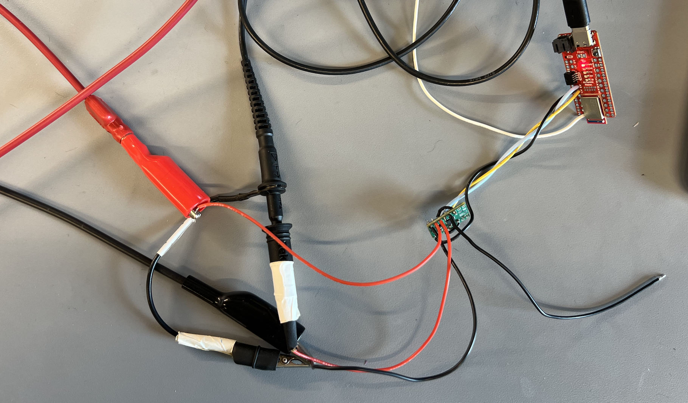
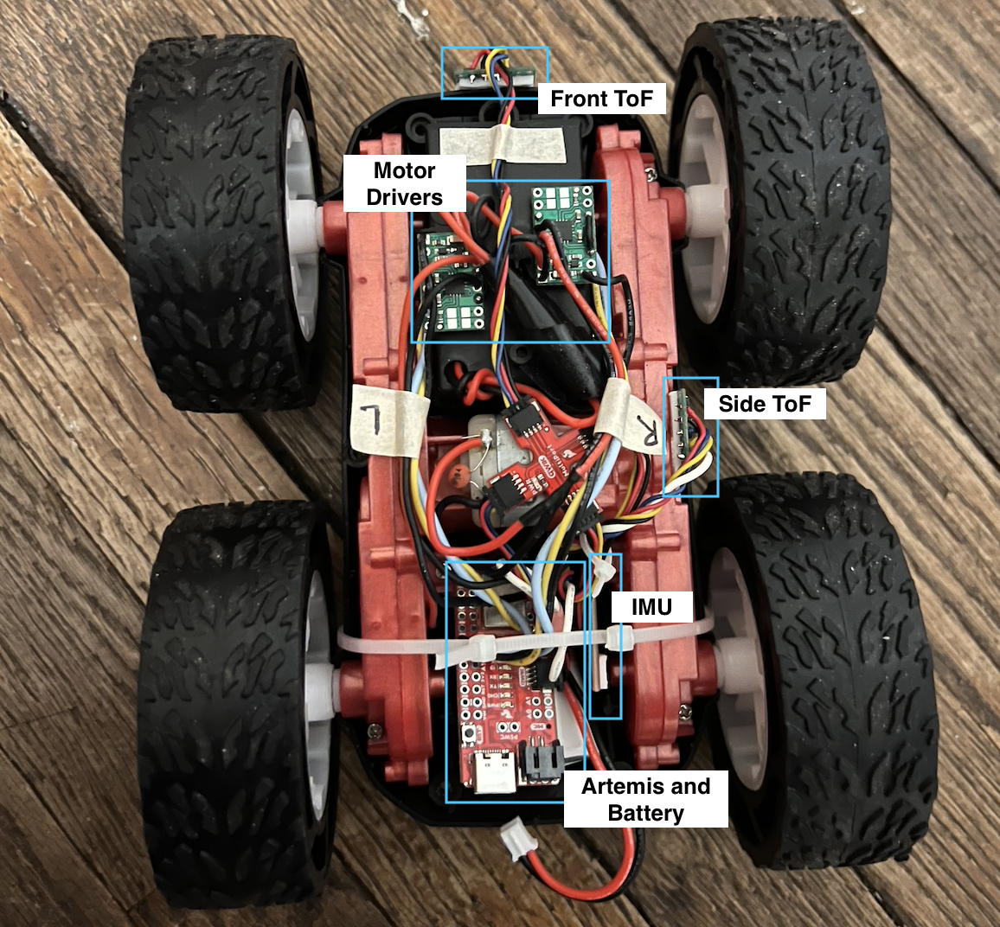
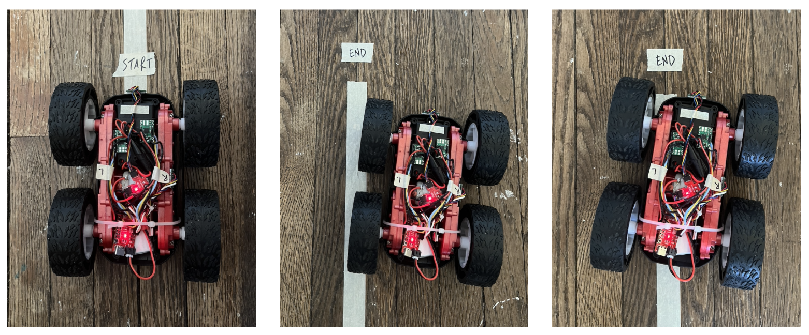

<link rel="stylesheet" href="../index.css" />

# Lab 4: Motors and Open Loop Control

The purpose of this lab is to add and test motor drivers. The robot uses 2 parallel-coupled DRV8833 dual motor drivers.

## Set Up


I parallel-coupled the inputs and outputs of each dual motor driver in order to deliver twice as much current. I'm connecting the motor driver input pins to A2, A3, A14, and A15 on the Artemis. I chose these pins because they are PWM enabled. According to the datasheet, pins 8 and 10 can't be used for PWM. Additionally, these pins are closer to the end of the Artemis which will be placed in the back slot of the car. I will have the usb port exposed to make it easier to upload code. I used standard wire colors: black for ground, red for power, blue/yellow for data. This made it easy to follow. I kept my wires short and twisted them to avoid EMI interference. This allowed everything to fit neatly as well. 

The Artemis and motor driver/motor are powered from separate batteries to avoid damaging the Artemis and reduce EMI. The motors can draw a lot of current, especially when starting up, which could cause the Artemis to malfunction or break.

Wiring Diagram:


## Lab Tasks

### One Motor Driver

Before soldering the battery and motors to motor driver #1, I tested that it was able to receive PWM signals sent through the Artemis. I used an external DC power supply and an oscilloscope to read the signal output. I set the power supply voltage to 3.7V because this matches the battery that I will be using. It's also in the range of what the motor driver accepts. I sent a PWM value of 128 which corresponds to a ~50% duty cycle which is reflected by my output reading. The voltage output is 3.7V as expected.

Oscilloscope reading PWM output for one motor driver:


Setup:



Power Supply:


Code for sending PWM signal: 
```
#define IN1 3
#define IN2 2

void setup() {
  pinMode(IN1,OUTPUT);
  pinMode(IN2,OUTPUT);
}
void loop() {
  analogWrite(IN1,128); 
  analogWrite(IN2,0);
}
```

After confirming that I was receiving the PWM signals, I connected the motors. While still running on an external power supply, I sent PWM values to spin the wheel backwards and forwards at different speeds. I also renamed the variables of the motor driver pins for clarity.

Wheel spinning: 
<video width="480" height="310" controls loop="" muted="" autoplay="">
    <source src="https://github.com/yating3/fast-robots/raw/refs/heads/main/Lab4/lab4_wheel_spin.MOV" />
</video>

Code for spinning the wheel:
```
void loop() {
  // forward fast
  Serial.println("fw");
  analogWrite(LEFT_BW,150); 
  analogWrite(LEFT_FW,0);
  delay(2000);

  // forward slow
  Serial.println("fw slow");
  analogWrite(LEFT_BW,50); 
  analogWrite(LEFT_FW,0);
  delay(2000);

  // backward fast
  Serial.println("bw");
  analogWrite(LEFT_BW,0); 
  analogWrite(LEFT_FW,150);
  delay(2000);

  // backward slow
  Serial.println("bw slow");
  analogWrite(LEFT_BW,0); 
  analogWrite(LEFT_FW,50);
  delay(2000);

  // brake
  Serial.println("brake");
  analogWrite(LEFT_BW,255); 
  analogWrite(LEFT_FW,255);
  delay(5000);
}
```

### Two Motor Drivers

I repeated the process for motor driver #2. I sent PWM values of 128 (50% duty cycle) and 64 (25% duty cycle) to motor driver #1 and #2 respectively. 

Code for sending 2 PWM signals:
```
void loop() {
  analogWrite(IN1,128); 
  analogWrite(IN2,0);
  analogWrite(IN3,64); 
  analogWrite(IN4,0);
}
```

Oscilloscope reading PWM output for both motor drivers:


### Assemble Car

I removed the control PCB that came with the car and connected the motor and battery wires to my board. I then installed all the components including my TOF sensors and IMU in the car chassis. This allowed me to power the car with the 850mAh battery. 



### PWM Lower Limit

The lower limit in PWM is 40 for moving forward and 110 for on-axis turns. I found these values by sending commands over bluetooth and increasing the PWM in increments of 10. My battery was partially charged when I tested this. I would be able to achieve lower values with a fully charged battery. I noticed that there was significant friction between the wheels and the floor because the wheels spun much faster when I lifted up the car. 

Car moving forward for 3 seconds then turning for 5 seconds:
<video width="480" height="310" controls loop="" muted="" autoplay="">
    <source src="https://github.com/yating3/fast-robots/raw/refs/heads/main/Lab4/lab4_lower_pwm.mov" />
</video>

Bluetooth commands:
```
ble.send_command(CMD.FORWARD, "50")
time.sleep(3)
ble.send_command(CMD.TURN, "130|0")
time.sleep(5)
ble.send_command(CMD.BRAKE, "")
```

Code for Arduino commands:

```
case FORWARD:   
  int fw_pwm;
  
  success = robot_cmd.get_next_value(fw_pwm);
  if (!success)
      return;
  
  analogWrite(LEFT_BW, 0);
  analogWrite(RIGHT_BW, 0);
  analogWrite(LEFT_FW, fw_pwm);
  analogWrite(RIGHT_FW, fw_pwm);
  break;

case BACKWARD:   
  int bw_pwm;
  
  success = robot_cmd.get_next_value(bw_pwm);
  if (!success)
      return;
  
  analogWrite(LEFT_BW, bw_pwm);
  analogWrite(RIGHT_BW, bw_pwm);
  analogWrite(LEFT_FW, 0);
  analogWrite(RIGHT_FW, 0);
  break;
  
  case BRAKE:   
  analogWrite(LEFT_BW, 255);
  analogWrite(RIGHT_BW, 255);
  analogWrite(LEFT_FW, 255);
  analogWrite(RIGHT_FW, 255); 
  
  break;

case TURN:   
  int turn_pwm;
  int dir;
  
  success = robot_cmd.get_next_value(turn_pwm);
  if (!success)
      return;
  
  success = robot_cmd.get_next_value(dir);
  if (!success)
      return;
  
  if (dir == 0) {
    analogWrite(LEFT_BW, 0);
    analogWrite(RIGHT_BW, turn_pwm);
    analogWrite(LEFT_FW, turn_pwm);
    analogWrite(RIGHT_FW, 0); 
  }
  
  if (dir == 1) {
    analogWrite(LEFT_BW, turn_pwm);
    analogWrite(RIGHT_BW, 0);
    analogWrite(LEFT_FW, 0);
    analogWrite(RIGHT_FW, turn_pwm); 
  }
  
  break;
```

### Calibration Factor

Since my left wheel spun faster than my right wheel, I needed to implement a calibration factor in order to get the car to drive straight. I drove the car for about 7 feet to see how close it was. I noticed that the speed difference was greater at lower pwm values. The photo below shows the starting and ending position for PWM values of 50 and 100. There is more drift for 50. The calibration may require additional adjustments in the future depending on the car speed.

Before Calibration:



To implement this, I need to multiply the right PWM value by a calibration factor. I found the scaling values experimentally by slowly incrementing them until the car was able to drive straight. I determined that I should multiply the right PWM value by 1.1.

After Calibration:
<video width="480" height="310" controls loop="" muted="" autoplay="">
    <source src="https://github.com/yating3/fast-robots/raw/refs/heads/main/Lab4/lab4_calib.mov" />
</video>

I combined the forward and backward commands into one drive command to make it easier to calibrate.

Modified Code:

```
if (drive_dir == 0) {
  analogWrite(RIGHT_FW, (pwm * cal));
  analogWrite(LEFT_FW, pwm);
  analogWrite(RIGHT_BW, 0);
  analogWrite(LEFT_BW, 0);
}

if (drive_dir == 1) {
  analogWrite(RIGHT_BW, (pwm * cal));
  analogWrite(LEFT_BW, pwm);
  analogWrite(RIGHT_FW, 0);
  analogWrite(LEFT_FW, 0);
}
```

### Open Loop

I was able to send commands and move the car over bluetooth.

Bluetooth commands:

```
ble.send_command(CMD.DRIVE, "80|0")
time.sleep(1)
ble.send_command(CMD.TURN, "140|0")
time.sleep(2)
ble.send_command(CMD.DRIVE, "80|0")
time.sleep(1)
ble.send_command(CMD.TURN, "140|1")
time.sleep(2)
ble.send_command(CMD.DRIVE, "80|0")
time.sleep(1)
ble.send_command(CMD.BRAKE, "")
```

Video of open loop control:
<video width="480" height="310" controls loop="" muted="" autoplay="">
    <source src="https://github.com/yating3/fast-robots/raw/refs/heads/main/Lab4/lab4_open_loop.mov" />
</video>

### Acknowledgements

I referenced Aidan McNay's website to ensure that my wiring and results were correct.
