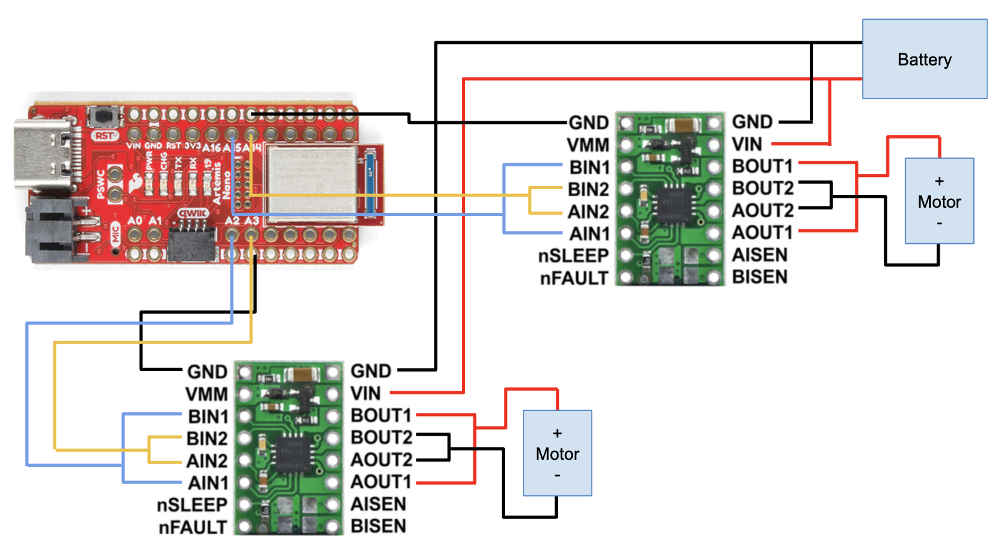
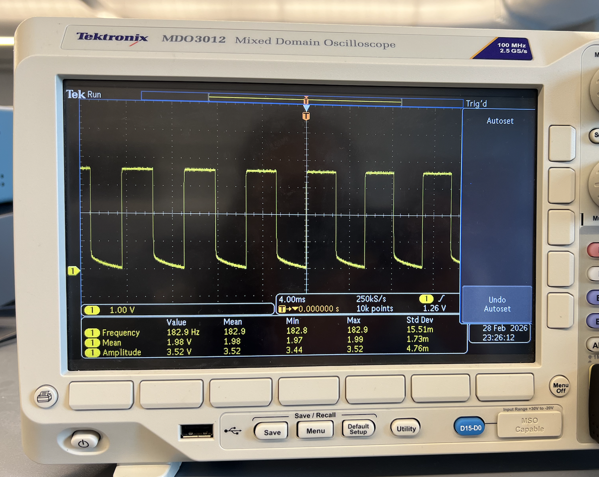
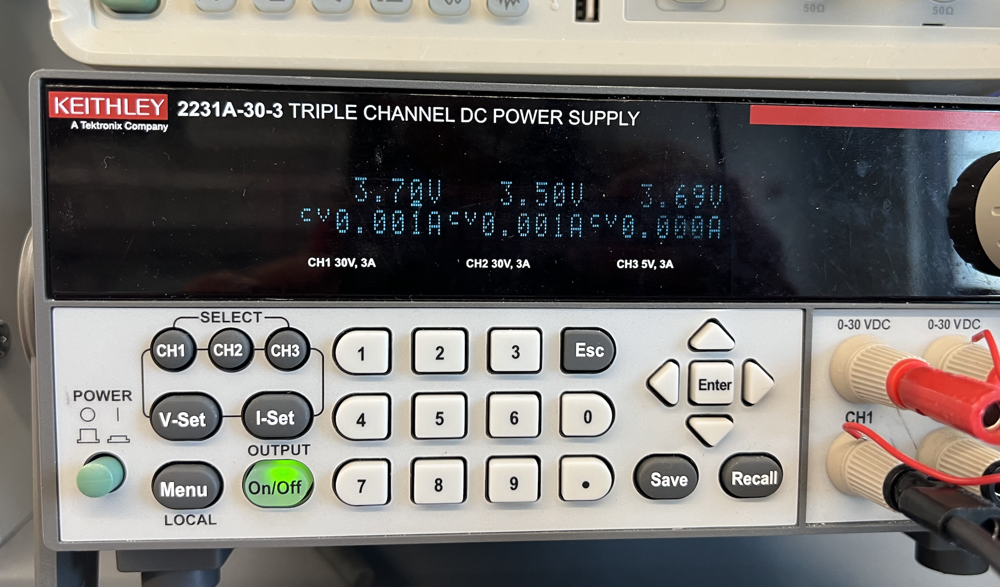
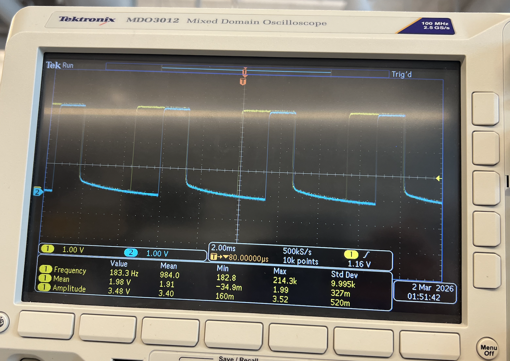

<link rel="stylesheet" href="../index.css" />

# Lab 4: Motors and Open Loop Control

The purpose of this lab is to add and test motor drivers. The robot uses 2 parallel-coupled DRV8833 dual motor drivers.

## Set Up
Note that to deliver enough current for our robot to be fast, we will parallel-couple the two inputs and outputs on each dual motor driver, essentially using two channels to drive each motor. This means that we can deliver twice the average current without overheating the chip. While it is a bad idea to parallel couple motor drivers from separate ICs because their timing might differ slightly, you can often do it when both motor drivers exist on the same chip with the same clock circuitry.
In your lab write-up, discuss/show how you decide to hook up/place the motor drivers.

- We ask you to power the Artemis and the motor drivers/motors from separate batteries. Why is that?
- Consider routing paths given EMI, wire lengths, and color coding. Long wires may not fit in the chassis, and lead to unnecessary noise. Wires that are too short, will make repair harder.

I'm connecting the motor driver input pins to A2, A3, A14, and A15 on the Artemis. I chose these pins because they are PWM enabled. According to the datasheet, pins 8 and 10 can't be used for PWM. Additionally, these pins are closer to the end of the Artemis which will be placed horizontally in the back slot of the car. I will have the usb port exposed to make it easier to upload code. The Artemis and motor driver/motor are powered from separate batteries to avoid damaging the Artemis and reduce EMI.  

I used 


Wiring Diagram:



[Battery discussion]

## Lab Tasks

1. Connect the necessary power and signal inputs to one dual motor driver (where inputs/outputs are hooked up in parallel as discussed in lecture) from the Artemis.
- For now, keep the motor driver (VIN) powered from an external power supply with a controllable current limit; this will make debugging easier.
- What are reasonable settings for the power supply?

Before soldering the battery wires to the motor drivers, I tested them using an external DC power supply. I set the voltage to 3.7V 

[Picture of your setup with power supply and oscilloscope hookup]
[Power supply setting discussion]

### One Motor Driver

Oscilloscope reading PWM output for one motor driver:



Power Supply:



```
#define MD1_IN1 2
#define MD1_IN2 3

void setup() {
  pinMode(IN1,OUTPUT);
  pinMode(IN2,OUTPUT);
}
void loop() {
  analogWrite(IN1,100); 
  analogWrite(IN2,0);
  delay(1000)
  analogWrite(IN1,50); 
  analogWrite(IN2,0);
}
```

### Two Motor Drivers

```

```

Oscilloscope reading PWM output for both motor drivers:



2. Use analogWrite commands to generate PWM signals and show (using an oscilloscope) that you can regulate the power on the motor driver output.

[Include the code snippet for your analogWrite code that tests the motor drivers]
[Image of your oscilloscope]

3. Take your car apart!
- Unscrew and remove the top (blue) shell from your car. You may have to cut the wires for the chassis LEDs (we will not be using them in this class). Don’t lose the screws!!
- Locate and unmount the control PCB and cut wires to the motors and the battery connector as close to the board as possible.

4. Place your car on its side, such that the spinning wheels are elevated, and show that you can run the motor in both directions.
- Keep the motor driver powered on an external power supply for now, but remember to connect all grounds in your circuit.

[Short video of wheels spinning as expected (including code snippet it’s running on)]

5. Power the motor driver from the 850mAh battery instead of the power supply (double check color codes before you plug it in), and make sure your code works when the circuit is fully battery powered.

[Short video of both wheels spinning (with battery driving the motor drivers)]

6. Repeat the process for the second motor and motor driver. One 850mAh battery should be enough to power both motors.

7. Install everything inside your car chassis, and try running the car on the ground.
- Remember, the car may flip, so try to avoid having components that stick out beyond the wheels.
- Also, the car is very fast, so test it in the hallway and add a timer in code so that it stops automatically after a short amount of time. That way you don’t have to try to catch it when it gets away from you!
- Here is an example of a car with everything hooked up (note that we did not use QWIIC connectors in this one). Remember that the implementation details are entirely up to you.

[Picture of all the components secured in the car. Consider labeling your picture if you can’t see all the components]

8. Explore the lower limit in PWM value for which the robot moves forward and on-axis turns while on the ground; note it may require slightly more power to start from rest compared to when it is running.

[Lower limit PWM value discussion]

9. If your motors do not spin at the same rate, you will need to implement a calibration factor. To demonstrate that your robot can move in a fairly straight line, record a video of your robot following a straight line (e.g. a piece of tape) for at least 2m/6ft.
- It may be helpful to note that each of the vinyl tiles in the lab is 1-by-1 foot.
- The robot should start centered on the line, and still partially overlap with the line at the end.

[Calibration demonstration (discussion, video, code, pictures as needed)]

10. Demonstrate open loop, untethered control of your robot - add in some turns.

[Open loop code and video]
