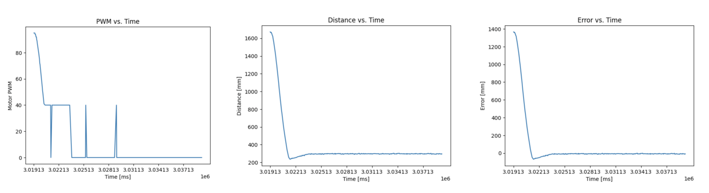

<link rel="stylesheet" href="../index.css" />

# Lab 5: Linear PID control and Linear interpolation

In this lab, I implemented a PID controller with the objective of getting the car to drive as fast as possible towards a wall and stop exactly one foot away.

### Bluetooth
I sent data over bluetooth by writing the code for a SEND_PID_DATA command in the ble_arduino.ino file. This command iterates through and sends data from the time, pwm, distance, and error arrays after the PID loop ends. I separated these 2 processes so that the PID controller could execute quickly. The data is added to the arrays as I run my PID control. I received this data by setting up a notification handler and calling the command in jupyter lab. My notification handler automatically prints and stores the data in arrays that make it easy to graph. This was very helpful for debugging.

Arduino code:
```
for (int i=0; i<PID_ARR_SIZE; i++) {
    tx_estring_value.clear();
    tx_estring_value.append(pid_time_arr[i]);
    tx_estring_value.append(",");
    tx_estring_value.append(pid_pwm_arr[i]);
    tx_estring_value.append(",");
    tx_estring_value.append(pid_dist_arr[i]);
    tx_estring_value.append(",");
    tx_estring_value.append(pid_err_arr[i]);
    tx_characteristic_string.writeValue(tx_estring_value.c_str());    
```

Jupyter code:
```
def pid_notification_handler(uuid, byte_array):
    s = ble.bytearray_to_string(byte_array)
    
    time, pwm, dist, err = s.split(",")
    print("Time: " + time, end = " ")
    print("PWM: " + pwm, end = " ")
    print("Distance: " + dist, end = " ")
    print("Error: " + err)

    time_arr.append(float(time))
    pwm_arr.append(float(pwm))
    dist_arr.append(float(dist))
    err_arr.append(float(err)*-1)
```

Additionally, I created a START_PID command that took 3 inputs: kp, ki, and kd. This made it easy to test new values without uploading code to the Artemis every time. I also initialized my variables here allowing the controller to be easily reset.

Arduino code: 
```
  success = robot_cmd.get_next_value(kp);
  if (!success)
      return;
  success = robot_cmd.get_next_value(ki);
  if (!success)
      return;
  success = robot_cmd.get_next_value(kd);
  if (!success)
      return;

  pid_started = true;
  prev_time = millis();
  prev_err = 0;
  prev_deriv = 0.0;
  integral = 0.0;
  pid_i = 0;
```

### PID
I implemented PID by creating a function run_pid that I called in my loop. It takes 3 inputs: setpoint, distance, and alpha. I decided to write the code for the complete PID controller from the beginning since it only took a few extra lines of code to implement. I could then set ki and kd to 0 until I finished tuning kp. 

PID controller code snippet:
```
  if (pid_i < PID_ARR_SIZE) {

      // P term
      int error = setpoint - distance;

      // I term
      float curr_time = millis();
      float dt = (curr_time - prev_time) / 1000.0;
      if (dt < 0.001) dt = 0.001;
      integral += error * dt;

      // D term
      float d = (error - prev_err) / dt;
      float derivative = alpha * d + (1.0 - alpha) * prev_deriv;
```
I decided to set a maximum and minimum PWM in order to prevent the car from slamming into the wall or getting stuck due to the deadband. From lab 4, I knew that my PWM had to be about 40 in order to overcome static friction. After experimenting with different values, I set my maximum to 180. 
```
      float u = kp * error + kd * derivative + ki * integral;
      
      if (u > MAX_PWM) u = MAX_PWM;
      if (u < -MAX_PWM) u = -MAX_PWM;

      // deadband
      int pwm = abs(u);
      if (pwm < MIN_PWM && pwm > 0) {
        pwm = MIN_PWM;
      }

      if (u < 0) {
        drive_straight(pwm, 0);
      }
      else {
        drive_straight(pwm, 1);
      }
...
```
I also set the ToF sensor to long mode instead of short mode so that it could detect the wall from further away. I set the timing budget to be the shortest possible for long mode which was 33ms in order to get quicker readings. 

### Tuning
#### P Controller
I started by tuning kp. Since I was starting about 2000mm from the wall with a PWM value of 180, I set my kp to 0.09. This was too fast and led to significant overshooting in the beginning so I lowered it until the car would overshoot less while still approaching at a fast speed. I landed on a kp of 0.07. 

PWM, Distance, and Error Graphs:


<video width="480" height="310" controls loop="" muted="" autoplay="">
    <source src="https://github.com/yating3/fast-robots/raw/refs/heads/main/Lab5/lab5_p.MOV" />
</video>

After seeing the results of just tuning kp, I didn't think I needed to tune ki and kd. The purpose of ki is to eliminate stead-state error by forcing the car closer to the target distance of 1 foot. I was already getting very close to the desired distance without this. The purpose of kd is to dampen the the response in order to prevent overshoot and reduce oscillation. I found that I didn't have significant oscillations and sufficiently reduced overshoot by lowering my kp value. Since I've implemented the full controller, I have the option of tuning these parameters in the future if necessary. 

PWM, Distance, and Error Graphs:
[graphs]

### Extrapolation

The frequency that the PID loop runs is limited by the rate at which the ToF sensor returns new data. From my data collection, the time between readings is about 40ms which corresponds to a frequency of 25Hz. In order to run the loop more frequently, we can reuse data points or extrapolate new ToF values.

To reuse the last saved data point, I created a distance variable to store it in and moved the call to run_pid outside of the conditional checking for new sensor data. This reduced the time between readings to about 10ms which corresponds to a frequency of 100Hz.

Next, I interpolated sensor readings. I did this by finding the slope of the last 2 datapoints. 

[graphs]
[video]
