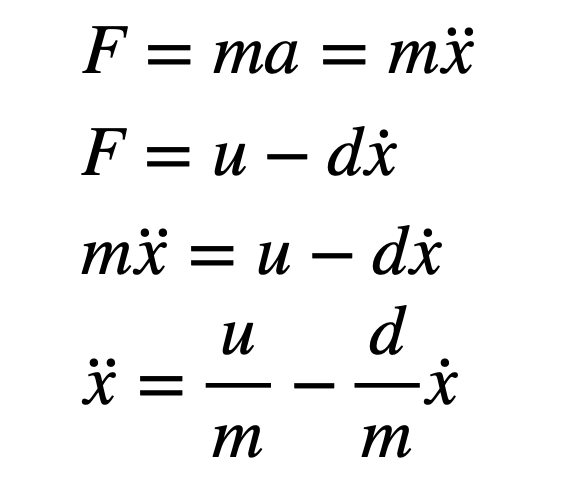

<link rel="stylesheet" href="../index.css" />

# Lab 7: Kalman Filter

The objective of this lab is to implement a Kalman filter in order to perform linear PID faster. A Kalman filter is an algorithm for estimating and predicting the state of a system that incorporates uncertainty. 

### Estimate Drag and Momentum

To start, I estimated drag and momentum terms. The derivation of the expression describing the dynamics of the system from the lecture [..] slides is below. The first 2 equations are Newton's 2nd law of motion and the linear force model with a drag term. By setting them equal, you get x&#776;. 

To build the state space model for your system, you will need to estimate the drag and momentum terms for your A and B matrices. Here, we will do this using a step response. Drive the car towards a wall at a constant imput motor speed while logging motor input values and ToF sensor output.

1. Choose your step responce, u(t), to be of similar size to the PWM value you used in Lab 5 (to keep the dynamics similar). Pick something between 50%-100% of the maximum u.. 
2. Make sure your step time is long enough to reach steady state (you likely have to use active braking of the car to avoid crashing into the wall). Make sure to use a piece of foam to avoid hitting the wall and damaging your car.
3. Show graphs for the TOF sensor output, the (computed) speed, and the motor input. Please ensure that the x-axis is in seconds.
4. Measure the steady state speed, 90% rise time, and the speed at 90% risetime. Note, this doesn’t have to be 90%, you could also use somewhere between 60-90, but the speed and time must correspond to get an accurate estimate for m.
5. When sending this data back to your laptop, make sure to save the data in a file so that you can use it even after your Jupyter kernel restarts. Consider writing the data to a CSV file, pickle file, or shelve file.

### Initialize Kalman Filter
1. Compute the A and B matrix given the terms you found above, and discretize your matrices. Be sure to note the sampling time in your write-up.

Ad = np.eye(n) + Delta_T * A  //n is the dimension of your state space 
Bd = Delta_t * B
2. Identify your C matrix. Recall that C is a m x n matrix, where n are the dimensions in your state space, and m are the number of states you actually measure.
This could look like C=np.array([[-1,0]]), because you measure the negative distance from the wall (state 0).
3. Initialize your state vector, x, e.g. like this: x = np.array([[-TOF[0]],[0]])

4. For the Kalman Filter to work well, you will need to specify your process noise and sensor noise covariance matrices.
Try to reason about ballpark numbers for the variance of each state variable and sensor input.
Recall that their relative values determine how much you trust your model versus your sensor measurements. If the values are set too small, the Kalman Filter will not work, if the values are too big, it will barely respond.
Recall that the covariance matrices take the approximate following form, depending on the dimension of your system state space and the sensor inputs.

### Implement and Test Kalman Filter in Jupyter (Python)
To sanity check your parameters, implement your Kalman Filter in Jupyter first. You can do this using the function in the code below (for ease, variable names follow the convention from the lecture slides).
- Import timing, ToF, and PWM data from a straight run towards the wall (you should have this data handy from lab 5).
- You may need to format your data first. For the Kalman Filter to work, you’ll need all input arrays to be of equal length. That means that you might have to interpolate data if for example you have fewer ToF measurements than you have motor input updates. This should also be handy from lab 5.
- Loop through all of the data, while calling the Kalman Filter.
- Remember to scale your input from 1 to the actual value of your step size (u/step_size).
- Plot the Kalman Filter output to demonstrate how well your Kalman Filter estimated the system state.
- If your Kalman Filter is off, try adjusting the covariance matrices. Discuss how/why you adjust them.
- Be sure to include a discussion of all the paramters that affect the performace of your filter.

### Implement Kalman Filter on Robot

Integrate the Kalman Filter into your Lab 5 PID solution on the Artemis. Before trying to increase the speed of your controller, use your debugging script to verify that your Kalman Filter works as expected. Make sure to remove the linear extrapolation step before doing this. Be sure to demonstrate that your solution works by uploading videos and by plotting corresponding raw and estimated data in the same graph.

The following code snippets give helpful hints on how to do matrix operations on the robot:

