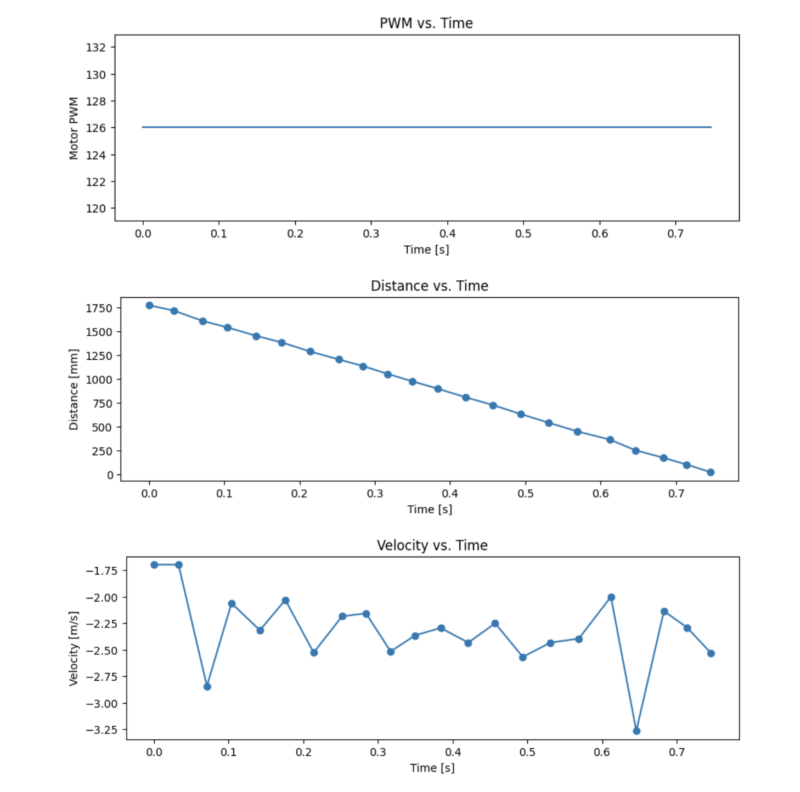
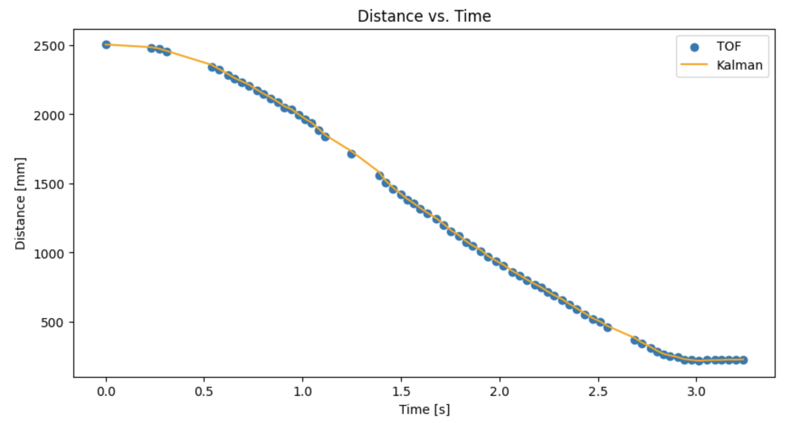

<link rel="stylesheet" href="../index.css" />

# Lab 7: Kalman Filter

The objective of this lab is to implement a Kalman filter in order to perform linear PID faster. A Kalman filter is an algorithm for estimating and predicting the state of a system that incorporates uncertainty. 

### Estimate Drag and Momentum

To start, I estimated drag and momentum terms. The derivation of the expression describing the dynamics of the system from the lecture slides is below. The first 2 equations are Newton's 2nd law of motion and the linear force model with a drag term. By setting them equal, you get x&#776;. 


Drag can be determined using constant speed. I found the constant speed by driving the car towards the wall at a constant PWM value. The value I chose was 126 because it's 70% of my maximum speed of 180. The PWM couldn't be too high because the robot needed to drive enough distance to reach a steady state speed and the starting distance is limited by the ToF sensing distance. The starting position of my car was about 2 meters away from the wall since I would be driving it very quickly and this distance is within the sensing range for long mode. I had the robot brake when it was 1 foot away from the wall in order to avoid crashing and damaging it.

I logged the PWM input and ToF sensor outputs by storing them in arrays then sending the data over bluetooth. I received it in Jupyter using a notification handler. I then used the time and distance readings to calculate velocity (dx/dt).

Plots of PWM/Distance/Velocity vs. Time:



From this I found:

Steady state speed: 2.32 m/s

90% rise time: 0.85 seconds

Speed at 90% rise time: 2.09 m/s

From the equations derived in lecture:

Drag: 1/2.32 = 0.431 kg/s

Momentum: (-0.431 * 0.85) / ln(1-0.9) = 0.159 kg

### Initialize Kalman Filter
I computed the A and B matrices, then discretized then. Delta_t is 0.035 seconds because
that's the time between readings. The C matrix is 1x2 because there are 2 dimensions in my state space and I'm measuring 1 state (distance). Distance has a positive 1 coefficient because I'm using the ToF distance output. Then, the state vector x is initialized.

Code:
```
d = 0.431 
m = 0.103
Delta_t = 0.035

# Compute A and B matrices
A = np.array([[0,1],[0,-d/m]])
B = np.array([[0],[1/m]])

# Discretize matrices
Ad = np.eye(2) + Delta_t * A 
Bd = Delta_t * B

C = np.array([[1,0]])
x = np.array([[dist_arr[0]],[0]])
```

For the Kalman filter, I needed to estimate variance for each state variable and sensor input. These values acts as weights that indicate how much I trust my model compared to my ToF distance measurements. The higher the uncertainty value, the lower my confidence is. Using the equations from lecture I found sigma_1 and sigma_2. For sigma_3, I used a slightly smaller value of 25 mm/s since I trust the ToF readings more than the model. 

Sigma_1: 54 mm/s

Sigma_2: 54 mm/s

Sigma_3: 25 mm/s

Code:
```
sigma_1 = 54 #position process noise
sigma_2 = 54 #velocity process noise
sigma_3 = 25 #sensor noise

sig_u = np.array([[sigma_1**2,0],[0,sigma_2**2]])
sig_z = np.array([[sigma_3**2]])
```

### Implement and Test Kalman Filter in Jupyter (Python)
In order to check that my Kalman filter is working before I implement it on my robot, I tested it in Jupyter. I used the following kf function. I then looped through the distance data and applied it.

```
def kf(mu,sigma,u,y):
    mu_p = Ad.dot(mu) + Bd.dot(u) 
    sigma_p = Ad.dot(sigma.dot(Ad.transpose())) + sig_u
        
    sigma_m = C.dot(sigma_p.dot(C.transpose())) + sig_z
    kkf_gain = sigma_p.dot(C.transpose().dot(np.linalg.inv(sigma_m)))

    y_m = y-C.dot(mu_p)
    mu = mu_p + kkf_gain.dot(y_m)    
    sigma=(np.eye(2)-kkf_gain.dot(C)).dot(sigma_p)

    return mu,sigma

sigma = np.array([[25**2, 0],[0, 5**2]]) #initial state uncertainty

kf_arr = []

for i in range(len(time_arr)):
    x, sigma = kf(x, sigma, 1, dist_arr[i])
    kf_arr.append(x[0])
```

Plot:



I was able to achieve a very accurate plot, so I did not need to adjust my values. If my filter didn't fit the data well, I could adjust the covariance values.

### Implement Kalman Filter on Robot

After verifying that my filter works in Jupyter, I implemented it on my robot. The code was very similar to the Python code. 

Initialization:
```
Matrix<2,2> Ad = {1, 0.035, 
                  0, 0.853};       

Matrix<2,1> Bd = {0, 0.340};  

Matrix<1,2> C = {1,0};      
Matrix<2,1> x = {0,0};    

Matrix<1> u = {1};  

sigma_1 = 54 //position process noise
sigma_2 = 54 //velocity process noise
sigma_3 = 25 //sensor noise

Matrix<2,2> sigma = {625, 0, 
                     0,   25};

Matrix<2,2> sig_u = {sigma_1*sigma_1, 0, 
                      0, sigma_2*sigma_2};
Matrix<1,1> sig_z = {sigma_3*sigma_3}; 
```

Kalman Filter function:

```
void kf( Matrix <2,1> &mu, Matrix <2,2> &sigma, Matrix<1,1> u , Matrix<1,1> y) {  
   Matrix<2,2> sigma_p = Ad * sigma * (~Ad) + sig_u;

   Matrix<1,1> sigma_m = C * sigma_p * (~C) + sig_z;

   Matrix<2,1> kkf_gain = sigma_p * (~C) * Inverse(sigma_m);

   Matrix<1,1> y_m = y - (C * mu_p);

   mu = mu_p + kkf_gain * y_m;

   Matrix<2,2> id = { 1, 0, 
                      0, 1 };
   sigma = (id - kkf_gain * C) * sigma_p;
}
```
