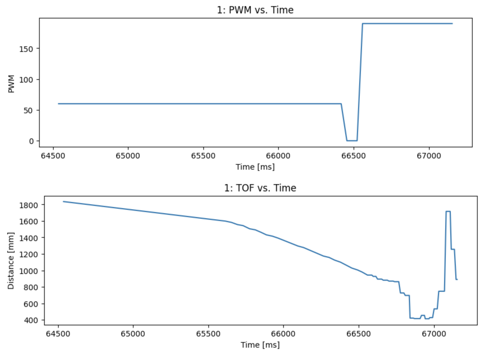

<link rel="stylesheet" href="../index.css" />

# Lab 8: Stunts!

In this lab I performed a stunt with my car. I chose to do a drift by driving the car forward 4m from the wall then initiating a 180 degree turn when the car was 3ft from the wall.

## Implementation

There are 2 main movements for this stunt: driving forward and turning 180 degrees. I used the ToF sensors to determine when the car was 3 feet from the wall. To do this I created a command called START_DRIFT in arduino that would set a flag in the loop to start moving straight forward. I used PID to check how far the robot was from the wall. Once it reached the setpoint, it would turn. I collected time, PWM input, and ToF data which I recieved using a notification handler.

Video:
<video width="480" height="310" controls loop="" muted="" autoplay="">
    <source src="https://github.com/yating3/fast-robots/raw/refs/heads/main/Lab8/lab8_stunt1.MOV" />
</video>

Plots:

