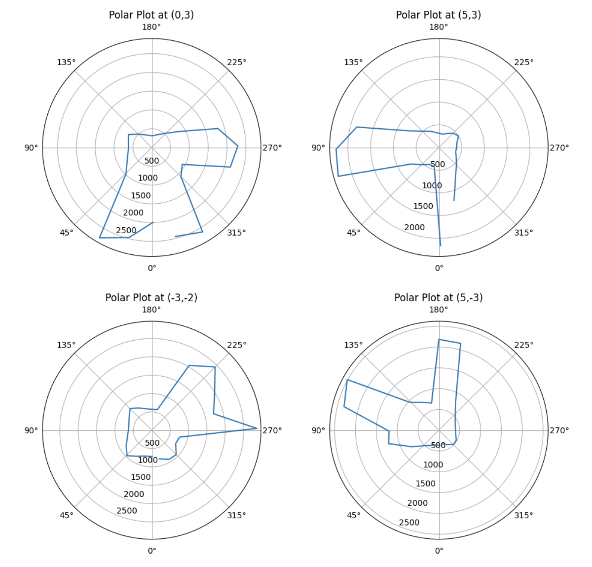
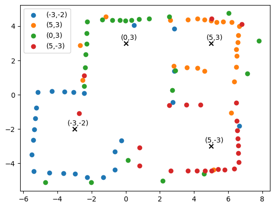
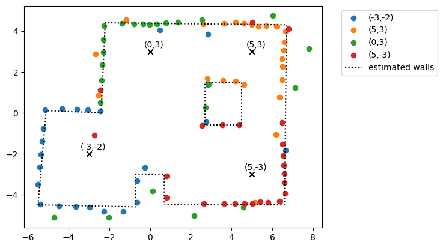

<link rel="stylesheet" href="../index.css" />

# Lab 9: Mapping

The objective of this lab is to build a map of a room by collecting ToF recordings as the robot spins 360 degrees on axis. I decided to collect this data using PID orientation control. 

## Implementation

I chose to use PID orientation control because this would allow me to get more accurate orientation positioning and ToF readings. The robot will be taking readings when the car has settled at the target orientation and is stationary. This yields more reliable distance readings.

In Arduino, I created a new command called START_MAPPING that would set a flag to begin rotations and data collection in the loop. I collected data in 15 degree rotation increments. I allowed about 2 seconds of time between measurements to allow the orientation PID to settle and get to the correct angle orientation. Additionally, I used DMP yaw data as this would be more accurate than the raw gyroscope data which tends to drift significantly. 

In Jupyter, I first sent a orientation PID command to set it in position 0 before I started. This is helpful as the initial movement was often the most unpredictable due to the potentially large angle change. I then sent the mapping command. Once I finished mapping, I sent a command to get the recorded time, ToF, yaw, and setpoint data. I used a notification handler to collect this data then saved it in a CSV file. I was able to get measurements within 1 degree of my setpoint increments. The robot behavior is reliable enough to assume that the readings are spaced equally in angular space, but I decided to use the DMP data since I had already collected it and it would be slightly more accurate.

There were various parameters that I had to tune in order to get the car to turn smoothly, spin on axis, and collect useful data. I manually tuned these parameters by sending  commands with different inputs in Jupyter and observed how the car responded.

Inputs tuned:
- Kp: Since the car would be making small angle changes, I lowered Kp in order to reduce oscillations and overshooting. I settled on a Kp of 0.005.
- Minimum PWM for PID: The PWM had to be high enough to be the car to turn. It also needed to be adjusted slightly based on the battery level. I tried to run it on a close to full battery as often as possible for consistency. I chose a minimum PWM of 130.
- Calibration factor: I needed to multiply my right motor by a calibration factor in order for it to spin at a similar rate to the left motor. This allowed the car to rotate on axis and significantly reduced drift. I chose a value of 1.08.
- Time between turns: The time between turns was determined through experimentation. I slowly increased it until the car was settling. The ideal time was 1600ms.
- Angle between turns: I chose 15 degrees as this would give me an accurate scan without taking too much time. I had to balance resolution, battery capacity, and measurement time.

Snippet of loop code:
```
  if (mapping_started) {
    if (turn_count < max_turns) {
      distanceSensor.startRanging();      
      int start_time = millis();

      while ((millis() - start_time) < map_time) {
        if (get_yaw()) {
          o_pid.run_opid(car_motor, angle);
        }
      }

      delay(200);                 

      map_distance = distanceSensor.getDistance();
      map_time_data[map_data_i] = millis();
      map_sp[map_data_i] = o_pid.setpoint_angle;
      map_tof_data[map_data_i] = map_distance;
      map_yaw_data[map_data_i] = angle;
      map_data_i += 1;

      digitalWrite(LED_BUILTIN, HIGH);  // turn the LED on (HIGH is the voltage level)
      delay(200);                 
      digitalWrite(LED_BUILTIN, LOW);   // turn the LED off by making the voltage LOW

      distanceSensor.clearInterrupt();
      distanceSensor.stopRanging();
      delay(1000);

      turn_count += 1;
      o_pid.setpoint_angle += map_angle;
    }
...
```

Car turning and collecting ToF readings:
<video width="480" height="310" controls loop="" muted="" autoplay="">
    <source src="https://github.com/yating3/fast-robots/raw/refs/heads/main/Lab9/lab9_mapping.mov" />
</video>

The blue LED blinks after every ToF reading. This was helpful for debugging and checking that data was being collected at each new angle after the car stopped oscillating. There was some drift, but the car stayed within the 1x1 ft square. The drifting from center can be attributed to uneven motor power, the floor (wheel slip, friction), and PID overshooting. The final position was offset from the center by ~1.5 inches in the x direction and ~0.5 inches in the y direction. In a 4x4m square, this would cause less than a 1% error. 

## Data Collection

I collected data at 4 marked positions in the lab space: (-3,-2), (5,3), (0,3), and (5,-3). The car started facing the negative y direction each time. Starting in the same orientation made it easier to map later.

Mapping area:


## Polar Coordinates

I used polar coordinate plots to make sure that the readings matched my expectations. I created a plot after scanning at each position. From the plots, I can see that the ToF has trouble detecting obstacles further than 1000mm.



## Transformations

I then used transformation matrices in Jupyter to convert my ToF readings to the intertial reference frame of the room. 

Python code for transformations:
```
x_coord = [-3,5,0,5]
y_coord = [-2,3,3,-3]

for c in range(4):
    position_arr = []
    for i in range(len(time_arr)):
        P = np.array([
            [all_dist[c][i] + 80],
            [0],
            [1]
        ])

        theta = -all_yaw[c][i] - np.pi/2
        
        T = np.array([
        [np.cos(theta), -np.sin(theta), x_coord[c]*304.8],
        [np.sin(theta), np.cos(theta),  y_coord[c]*304.8],
        [0,              0,             1               ]
        ])
        
        global_P = T @ P
        position_arr.append(global_P)
```

After applying transformations, I produced the following map of the room:



I then added lines based on the global coordinates. The lines weren't perfectly straight, but the general shape of the map was very close to the actual arena. The inconsistencies are likely due to slight drift as the robot was turning and ToF noise. The accuracy and resolution of the map is also limited by the number of data points collected and the number of positions data was collected from. 


